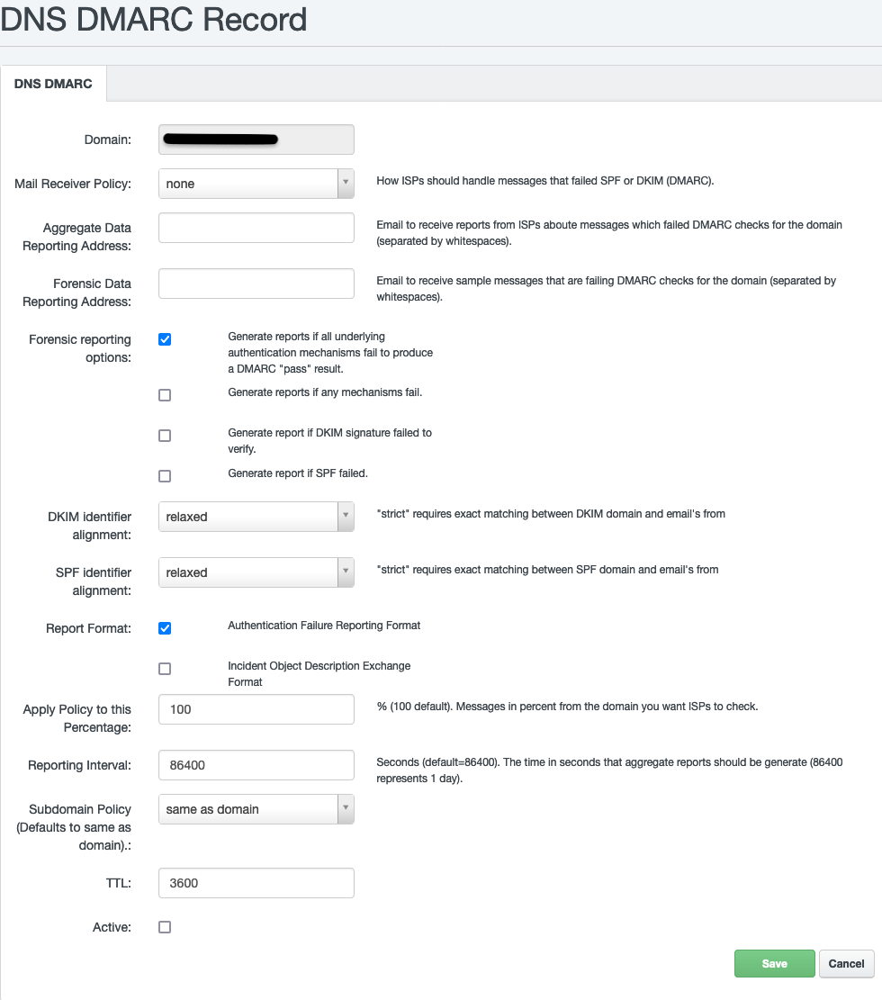

# DMARC

## Introduction

In the ever-evolving landscape of cybersecurity, email security is of paramount importance. Domain-based Message Authentication, Reporting, and Conformance (DMARC) is a crucial tool that enhances email security by preventing phishing and spoofing attacks. In this article, we will delve into the fundamentals of DMARC, its purpose, principles, and a step-by-step guide on how to correctly configure it for your domain.

## What is DMARC

DMARC, an acronym for Domain-based Message Authentication, Reporting, and Conformance, is an email authentication protocol that enables domain owners to protect their email domains from unauthorized use. It builds upon existing email authentication technologies such as [SPF](emails/#dkim-spf) (Sender Policy Framework) and [DKIM](emails/#dkim-spf) (DomainKeys Identified Mail) to provide a comprehensive solution for email security. Thus, it coordinates the result of DKIM and SPF checks and specifies under what conditions the sender's address in the email (```From:``` header) is to be considered trusted.

## Purpose of DMARC

The primary purpose of DMARC is to combat email phishing and spoofing. By allowing domain owners to set policies for their email authentication mechanisms, DMARC helps in verifying the authenticity of the sender's identity. This, in turn, enhances email deliverability and protects both the sender and the recipient from malicious activities.

## Principles of DMARC

DMARC operates on three fundamental principles:

1. **Authentication:** DMARC leverages SPF and DKIM to authenticate the sender's identity, ensuring that the email is indeed from a legitimate source.
2. **Reporting:** DMARC generates detailed reports on email authentication results, providing domain owners with valuable insights into the usage of their domains and helping them identify potential threats.
3. **Conformance:** DMARC enables domain owners to specify how email receivers should handle messages that fail authentication. This allows for a consistent approach to unauthorized emails across different email providers.

## Configuring DMARC on Your Domain

Configuring DMARC on your domain involves a series of steps to ensure optimal security.

!!! notice
        For DMARC to work, you must have an active SPF and DKIM.

You can configure DMARC either manually by setting up a DNS TXT record, or by using our DMARC Generator in the [Hosting Control Panel](https://my.nuclear.hosting) under the DNS section.



### Set up DMARC manually by setting up a TXT record

Create a DMARC TXT record in your domain's DNS settings. If DMARC is to apply to a ```main``` domain (e.g. example.tld), it is set as a 3rd level domain named **_dmarc** (i.e. ```_dmarc.example.tld```). If it is to be valid for a subdomain (e.g., sub.example.tld), it is set as a 4th level domain name (i.e., ```_dmarc.sub.example.tld```).

Specify the policy for how to handle failed authentication (p=none, quarantine, or reject). Define an email address to receive DMARC reports (rua and ruf tags).

> **Example DMARC Configuration 1: Monitoring-Only Policy:**
>
> ```
> v=DMARC1; p=none; rua=mailto:dmarc@example.tld; ruf=mailto:forensic@example.tld
> ```
>
> Explanation: This example implements a monitoring-only policy, allowing you to collect data on email authentication results without impacting the > delivery of emails.

**Gradual Policy Implementation:**

Start with a monitoring-only policy (p=none) to analyze the impact on your email flow. Gradually move to a more restrictive policy based on your analysis.

> **Example DMARC Configuration 2: Quarantine Policy:**
>
> ```
> v=DMARC1; p=quarantine; rua=mailto:dmarc@example.tld; ruf=mailto:forensic@example.tld
> ```
>
> Explanation: This example implements a quarantine policy, instructing email receivers to quarantine emails that fail authentication, preventing suspicious emails from reaching the recipient's inbox.


**Utilize Reporting Mechanisms:**

Leverage DMARC reports (aggregate and forensic) to gain insights into email authentication results. Regularly review and analyze these reports to identify and address potential issues.

> **Example DMARC Configuration 3: Reject Policy with Subdomain Policy:**
>
> ```
> v=DMARC1; p=reject; rua=mailto:dmarc@example.tld; ruf=mailto:forensic@example.tld; sp=reject
> ```
>
> Explanation: This example implements a reject policy, the strictest policy, instructing email receivers to reject emails that fail authentication. The additional sp=reject extends the policy to subdomains, ensuring a consistent and stringent approach across the entire domain hierarchy.

**Monitor and Adjust:**

Regularly monitor your DMARC reports and adjust policies as needed. Use the information from reports to refine your email authentication setup.

## Configuration Options and Flags

DMARC configuration involves several options and flags, including:

- ```p``` (Policy): Determines the policy to be applied (none, quarantine, reject).
- ```rua``` (Aggregate Report URI): Specifies the URI where aggregate reports should be sent.
- ```ruf``` (Forensic Report URI): Specifies the URI where forensic reports should be sent.
- ```ri``` (Reporting Interval): Defines the time in seconds that the reporting entity should wait before sending aggregate reports to the specified URI.
- ```fo``` (Forensic Options): specify how forensic reports should be generated and handled ("0" (generate no forensic reports), "1" (generate forensic reports if the message fails the DMARC check), and "d" (generate forensic reports for all messages))
- ```pct``` (Percentage of Messages to Apply Policy): allows domain owners to gradually enforce the DMARC policy on a percentage of their messages (100 means 100%, i.e. all messages).
- ```sp``` (Subdomain Policy): Allows domain owners to specify the policy for subdomains.
- ```adkim``` (Align DKIM): Specifies whether DKIM should align with the organizational domain.
- ```aspf``` (Align SPF): Specifies whether SPF should align with the organizational domain.

## DMARC settings for Google

Starting February 1, 2024, [Google is rolling out changes](https://support.google.com/a/answer/81126) for senders who send more than 5,000 messages per day to Gmail accounts (@gmail.com or @googlemail.com). Now, in addition to the correct SPF and DKIM configurations, DMARC settings will be a requirement for successful message receipt.

According to the available information, it should be sufficient to set the domain to a neutral DMARC, i.e. an entry of the form:

```v=DMARC1; p=none; rua=mailto:youremail@example.tld```

## Conclusion

Implementing DMARC on your domain is a proactive step towards securing your email communication. By understanding the principles, purpose, and configuration options of DMARC, you can fortify your email infrastructure and contribute to a safer online environment. Stay vigilant, monitor your DMARC reports, and adjust your policies accordingly to stay one step ahead of potential threats.