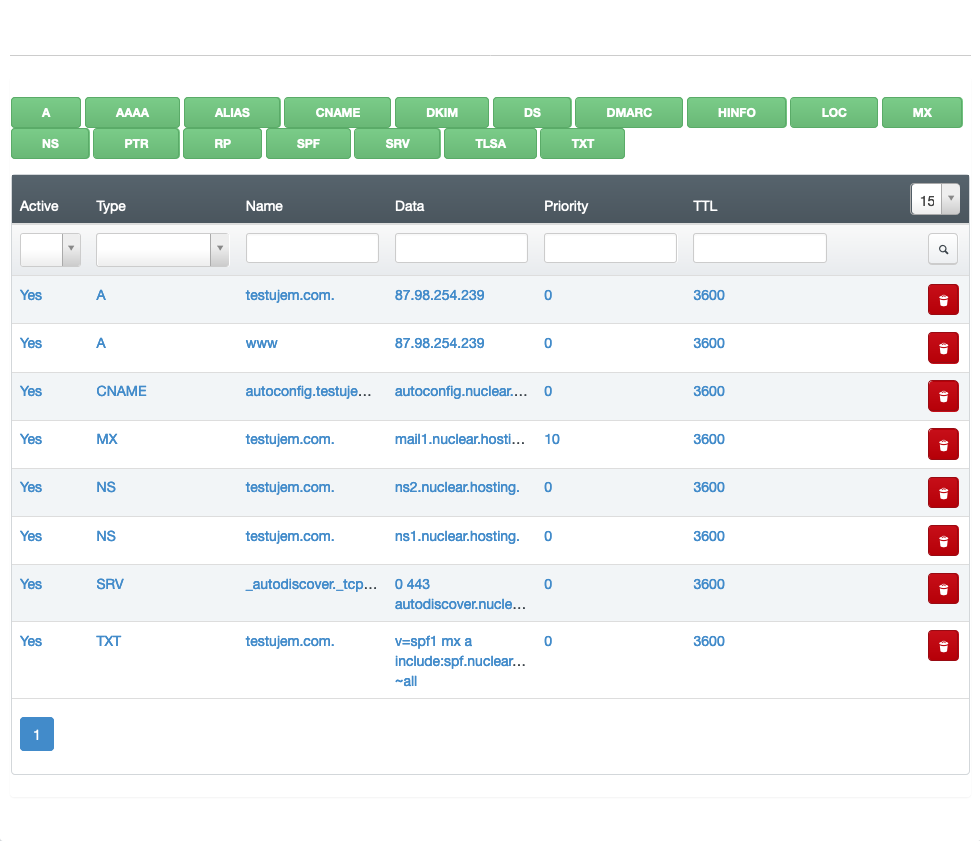

# DNS - Domain Name Server

Domain Name System (DNS) is a hierarchical distributed name system for computers, mobile phones, services, or any other device that is connected to the Internet or to a private network.

DNS translates numerical addresses of individual devices or services into a textual form that is more digestible and memorable.

For example, if you type www.google.com into the address bar of your web browser, you will be taken to the Google web. Even if you type "173.194.65.94" (without the quotation marks) in the address bar, you'll get exactly the same result. Of course, it is easier for people to remember the site name than its numeric address.

To load a content on your domain from any server you have to point your domain name to this particular server's IP address in its DNS zone. DNS zone for domain can be created on any DNS server you have access to and which allows you to create a DNS zone for your domain. After setting up a DNS zone for domain you need to change your DNS Name servers of your domain to those DNS servers (where DNS zone is created).

!!! note
	Nuclear.Hosting offers a DNS NameServers & online DNS records management for your domains free of charge for both memberships (Basic and VIP).

## What is a DNS record

It is a record that shows where the domain will be directed / pointed. In addition to what web hosting and web site will be pointed to, it also sets where emails sent to the domain will be delivered.

!!! important
	**Unprofessional interventions / changes with the DNS record settings can cause failure to your site or emails.**

The most common DNS records are:

  - A - address record, contains the IPv4 address that is assigned to that name (the webserver IP address)
  - AAAA - IPv6 address record, contains the IPv6 address that is assigned to that name
  - CNAME - canonical name record, serves as another name for the name already introduced
  - MX - maxil exchange record, is used to report the address and priority for receiving e-mail for a given domain
  - TXT - text record, is most commonly used for any text
  - SRV - service locator, is a generic local service record, used with newer protocols, where it is used instead of specific records (such as MX)

## How to create a DNS zone for my domain

Ask your domain name registrar to change DNS Nameservers for your domain (or made change by yourself) to these ones:

!!! important
	**NS1 (primary):** ns1.nuclear.hosting

	**NS2 (secondary):** ns2.nuclear.hosting

!!! tip
	If you have DNSSEC enabled on your domain, delete all set DNS keys together with the nameserver change!

!!! note
	**The changes take effect during next 24 hours.**

Now you have to create a DNS zone on our DNS NameServers. To do that, log in to your [Hosting Control Panel account](https://my.nuclear.hosting) and navigate to ```DNS``` section located in the top menu.

Now, click on the ```Add new DNS Zone with Wizard``` button. In ```Template``` field choose ```Webhosting``` and enter your domain name into ```Domain``` field. Now, just click on the ```Create DNS-Record```.

## How to setup DNS records for my domain on third-party DNS NameServers

You need to setup ```A```, ```AAAA```, ```CNAME```, ```TXT``` and ```MX``` records.

!!! tip
	We do not recommend this variation. We recommend using our DNS Nameservers where all DNS records are set up correctly automatically.

Setup these DNS records:

 - **A record:** the server IPv4 address for your domain you can find on the Dashboard page in your [Hosting Control Panel account](https://my.nuclear.hosting)
 - **AAAA record:** the server IPv6 address for your domain you can find on the Dashboard page in your [Hosting Control Panel account](https://my.nuclear.hosting)
 - **TXT record:** ```v=spf1 mx a include:spf.nuclear.hosting ~all```
 - **MX record (if you want to use our e-mail servers):** ```mx1.nuclear.hosting``` with priority 10 and ```mx2.nuclear.hosting``` with priority 20.

## How to change my domain DNS records

!!! important
	**We do not recommend to change any DNS settings if you do not have appropriate experience and knowledge. Any lay / inexpert changes may cause your domain or emails stop working!**

To change, remove or add a DNS records for your domain log in to your [Hosting Control Panel account](https://my.nuclear.hosting) and navigate to ```DNS``` section located in the top menu. In the list click on the domain for you want to change DNS settings and then click on the ```Records``` tab.

Now you can add a many types of new DNS records just by clicking on the Green buttons marked by DNS record type.

To edit a particular DNS record just click on the record in the table, made required changes and save by clicking on the ```Save``` button.

If you want to delete any DNS record, click on the red bin button in the list.



!!! note
	**Any DNS changes takes effect during the next 24 hours.** The default zone TTL is 24 hours and cannot be changed. The lowest TTL for any record is 3600.
