# E-Mail services

In this section you can find all topics related to e-mail services management (mailboxes, catches, forwardings, filters and more).

## Primary and Secondary incomming server

!!! important
	**Primary incomming / delivery server:** mx1.nuclear.hosting

	**Secondary (backup) incomming / delivery server:** mx2.nuclear.hosting

## Managing your Mailbox

### How to access to mailbox

There are two options, how you can access to your mailbox:

1. Using **e-mail client** and IMAP / POP3 or secured IMAPs / POP3s
2. Using [**web interface (webmail)**](https://webmail.nuclear.hosting)

!!! hint
	We would recommend you to use e-mail client, rather than webmail on daily basis to your mailbox.

### How to create a new mailbox

You can create a new mailbox in [Hosting Control Panel](https://my.nuclear.hosting), in ```Email``` section.

Before you will be able to create a new mailbox, you have to create / setup your domain into E-Mail servers. For more details, [continue here](#how-to-setup-domain-into-email-servers).

In the left-hand menu, click on the ```Email Mailbox``` and when the mailboxes overview is loaded, click on the ```Add new Mailbox``` button.

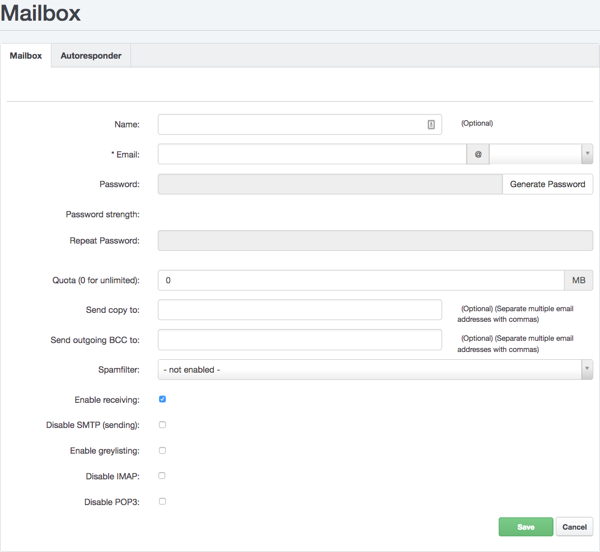

Now, you have to complete the form with all mailbox details:

- **Name:** (optional) name of your mailbox (eg. John Doe Personal)
- **Email:** this input is splitted into two parts: before (left side) and after (right side) ``@`` sign.
	- left side (before ``@``): mailbox name (eg. johndoe)
	- right side (after ``@``): your domain name which you creating mailbox on (eg. example.com). If your domain is not listed in the select box, you have to setup it first. [Read more here](#how-to-setup-domain-into-email-servers).
	- The result will be: ``johndoe@example.com``
- **Password:** put password that you will use to signing into this new mailbox. You can use your own or generate random strong password. To generate a new password, just click on the ```Generate Password``` button and than copy (save and remember) this password.
- **Repeat password:** enter the same password like one step before for verification purpose. If you used the ```Generate Password``` feature, you can skip this step - password is repeated / inserted automatically.
- **Quota:** you can setup max. size of mailbox. If you want to keep size unlimited, just enter ```0```. The size is in MegaBytes (MB) unit.
- **Send copy to:** (optional) send copy of all incoming e-mails to another email address (or multiple addresses). Separate multiple email addresses with commas.
- **Send outgoing BCC to:** (optional) send copy of all incoming emails as BCC (hidden copy) to another email address (or multiple addresses). Separate multiple email addresses with commas.
- **Spamfilter:** select which antispam policy ([read more about antispam policies](#antispam-policies)) you want to apply for this mailbox. You can also disable antispam.
- **Enable receiving:** you can enable/disable incoming e-mails receiving into this mailbox.
- **Disable SMTP (sending):** you can enable/disable outgoing e-mail sending from this emailbox (outgoing SMTP).
- **Enable greylisting:** you can enable/disable Greylist protection of incoming e-mails
- **Disable IMAP:** you can enable/disable IMAP access to this mailbox
- **Disable POP3:** you can enable/disable POP3 access to this mailbox

After you complete the all required fields in form, just click on the ```Save``` button.

!!! note
	Changes take effect within a few minutes.

All settings you made during mailbox creation can be anytime changed.

### How to change mailbox settings

To change mailbox settings you have three options where you can do your changes:

1. In the [Hosting Control Panel](https://my.nuclear.hosting) by signing in with **your hosting account credentials**. In the ```Email``` section and then in the left-hand menu ```Email mailbox``` you can see the overview of all created mailboxes. To edit any of them, just click on the mailbox name. You can change any of the settings descibed in the [How to create a new mailbox](#how-to-create-a-new-mailbox) section here. By clicking on the red "bin" or "trash" button in the mailboxes overview, you delete this mailbox with all emails stored in.
2. In the [Hosting Control Panel](https://my.nuclear.hosting) by signing in with **your email mailbox credentials**. You can login in by entering mailbox name (eg. johdoe@example.com) and with password related to this mailbox. You will be able to manage all particular mailbox details (password, autoresponder, copies sending, spamfilter, e-mail filters), without access to another mailboxes on this domain or any other settings, out of the mailbox settings. You are not able to delete this mailbox or change Quota settings.
3. In the [Webmail interface](https://webmail.nuclear.hosting) by signing in with **your email mailbox credentials**. Navigate to ```Settings``` and ```Account``` section. Here you can change mailbox password, email forwardings, autoreply, mail filters and antispam settings.

### How to setup domain into Email servers

To setup your domain into E-Mail servers, navigate to your [Hosting Control Panel](https://my.nuclear.hosting), continue to ```Email``` section, in the top menu and than click on the ```Domain``` section located in the left-hand menu.

!!! note
	This step is necessary only once. After you setup your domain to e-mail system, you can create new mailboxes and other stuff without repeating this step again.

To add a new domain, click on the ```Add new Domain``` button.

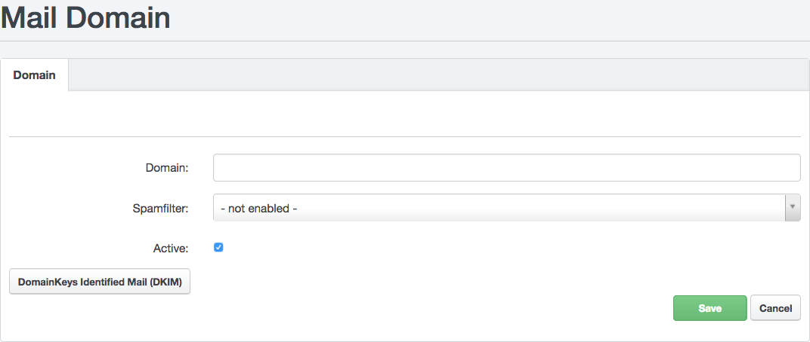

Complete the form:

- **Domain:** Enter your domain name you want to add to e-mail system
- **Spamfilter:** Select spamfilter, if you want to protect your domain against spam
- **Active:** keep checked, otherwise you will be not able to receive and send emails from this domain
- (optional) DomainKeys Identified Mail (DKIM): You can setup DKIM signing for your domain (more information about enabling DKIM)

After you completed the form, just click on the ```Save``` button.

!!! note
	Changes take effect within a few minutes.

!!! hint
	You can also setup your domain into E-Mail system by using [Hosting Wizard tool](../start/#how-to-create-webhosting-using-hosting-wizard).

### E-Mails forwarding

All incoming e-mails you can forward to another e-mail address. In this case, the message is forwarded to the destination address immediately upon receipt. You can also redirect the mailbox to multiple addresses at once.

!!! important
	We do not recommend that you set up an email address on any domain that we does not provide mailing services (such as, for example, gmail.com, yahoo.com, and so on) as the destination mailbox! Such redirection may not work properly.

### How to change mailbox size / quota

You can define your own size / quota for every mailbox. You can set mailbox size during [mailbox creating](#how-to-create-a-new-mailbox) or [anytime later](#how-to-change-mailbox-settings).

In addition to the size / quota of the mailbox, there is also limit for the number of messages (files) stored in one mailbox (20,000) and all mailboxes in the given domain (to 100,000).

If the mailbox or domain exceed allocated quota to the size or number of files, new e-mail messages are not received and the senders receive a non-delivery report due to the recipient's full mailbox.

### Autoreply

You can set an autoreply (Out of office message) for the mailbox, for example if you want to let the sender know about your absence (eg Holiday).

The message you enter is automatically sent in response to the incoming email. Default auto-reply interval to the same sender is 30 minutes. For example, when one sender sends two messages within 10 minutes, he receives only one automatic answer.

!!! important
	The allowed auto-reply interval is within 15minutes - 30days. If you setup auto-reply by mail filters (sieve), please, respect this restriction! If you setup outside range value, your auto-reply may be disabled or corrected.

You can also specify a time period within you want to be your auto-reply delivered, for example from 10.01.2018 10:30 to 15.01.2018 08:00.

To setup your autoreply, you have four options:

1. In the [Hosting Control Panel](https://my.nuclear.hosting) by signing in with **your hosting account credentials**. Navigate to ```Email``` section, in the left-hand menu click on the ```Email Mailbox```, in the mailboxes overview click on mailbox you want to create auto-responder and click on tab ```Autoresponder```. You need to fill ```E-Mail Subject```, ```Text```, check or uncheck ```Enable the autoresponder``` option, ```Start on``` and ```End by```.
2. In the [Hosting Control Panel](https://my.nuclear.hosting) by signing in with **your email mailbox credentials**. After you log in with your mailbox credentials, click on the ```Autoresponder``` in the left-hand menu. You need to fill ```E-Mail Subject```, ```Text```, check or uncheck ```Enable the autoresponder``` option, ```Start on``` and ```End by```.
3. In the [Webmail interface](https://webmail.nuclear.hosting) by signing in with **your email mailbox credentials**. Navigate to ```Settings``` and ```Account``` section. In the left-hand menu click on the ```Autoreply```. You need to fill ```E-Mail Subject```, ```Text```, check or uncheck ```Enable the autoresponder``` option, ```Start on``` and ```End by```.
4. Email filters (Sieve filters). You can set up your autoresponder using Sieve e-mail filters directly from your e-mail client software, if it support them. **Please respect auto-reply interval (see above).**

### How to delete mailbox

Delete mailbox is possible in the [Hosting Control Panel](https://my.nuclear.hosting), in the ```Email``` section. Click on the ```Email Mailbox``` in the left-hand menu, in the overview find mailbox you want to delete and click on the red trash button.

**Deleting the mailbox also deletes all messages in the mailbox** and deletes the message sending access. The mailbox is also automatically removed from the settings of other mailboxes or domains in our mailing system, for which it is used as the destination for redirecting or sending copies.

### Additional IMAP information

We have auto-delete option enabled for IMAP Trash, INBOX / Junk and Junk folders on mail storage, messages older than 30 days are removed from them automatically. These folders typically create a mail client or webmail at first login, they are used to store deleted messages or  messages marked as spam.

Our IMAP servers support an IDLE extension that ensures that the server immediately informs the connected client of the incoming message (ie, beyond the usual regular check intervals).

Our IMAP servers support sharing of IMAP folders between different mailboxes on one domain.

Our IMAP servers support quota information check.

## How to setup e-mail client to access my mailbox

In general, you need to know Incoming server, Outgoing server (smtp) and your mailbox credentials.

We recommend using e-mail clients, such as MS Outlook, Thunderbird (an e-mail program that you install on your computer / tablet / smartphone), rather than Webmail interface.

### Incoming server (IMAP / POP3)

To set up emails receiving to a email client, you need a server address for incoming mail, username and password.

!!! important "IMAP / POP3 server"
	**POP3 server:** mail.nuclear.hosting, port: default (110, 995 for SSL/TLS)

	**IMAP server:** mail.nuclear.hosting, port: default (143, 993 for SSL/TLS)

	**Your username is your email address** (eg johndoe@example.com - always lowercase).


### Outgoing server (SMTP)

You can use any SMTP server, such as the SMTP server of your ISP (some providers do not allow others) to send emails.

!!! important "Our SMTP server"
	**SMTP server:** smtp.nuclear.hosting, ports: 25 or 587

	SMTP server requires authentication. Use the same credentials like for IMAP/POP3.

	For encrypted connection use STARTTLS.

This server is for regular communication only (physical persons), not for sending bulk messages, sending messages from PHP applications (for this use PHP mail() function) or any automatic devices.

### The difference between POP3 and IMAP4

**IMAP (Internet Messaging Access Protocol):**

- Emails are stored on the server.
- Sent messages are stored on the server.
- Messages can be synced and accessed across multiple devices.

**POP3 (Post Office Protocol):**

- Emails are stored on a single device.
- Sent messages are stored on a single device.
- Emails can only be accessed from a single device.
- If you want to keep messages on the server, make sure the setting "Keep email on server" is enabled or all messages are deleted from the server once downloaded to the app or software.

!!! hint
	We recommend to using IMAP protocol.

### E-Mail Client Autoconfiguration / Autodiscover

Our e-mail servers supports Autoconfiguration / Autodiscover feature. It allows to your e-mail client which support one of these features provide automatic configuration for them, so you don't need to enter manually POP3/IMAP server address, SMTP server addresses, ports and so on. E-Mail client based on your email address (username) you input detects appropriate settings.

To use e-mail client autoconfiguration you have met two conditions:

 1) Set up properly necessary DNS records: if you are using our DNS Nameservers, needed DNS records are setup automatically, when you creating DNS zone for your domain in Hosting Control Panel. If you are not using our DNS Nameservers you have to create these two DNS records (replace ```YOURDOMAIN.COM``` with your real domain name):
```
autoconfig.YOURDOMAIN.COM. CNAME autoconfig.nuclear.hosting.
_autodiscover._tcp.YOURDOMAIN.com. SRV 0 0 443 autodiscover.nuclear.hosting.
```
 2) E-Mail client which supports autoconfiguration / autodiscover: these features are supported by Mozilla Thunderbird, Microsoft Outlook, Microsoft Live Mail. **Apple® email clients do not support AutoConfig or AutoDiscover for IMAP servers.**

### How to configure Mozilla Thunderbird (auto-configuration)

Mozilla Thunderbird email client autoconfiguration setup instructions for receiving and sending emails.

#### 1. Enter the base account details

 - **Your name:** the name for this email account
 - **E-Mail Address:** enter your email account address
 - **Password:** password to that email account
 - **Remember password:** check this option

Click on the ```Continue``` button.

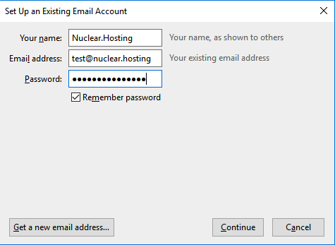

#### 2. Verify values and you are done!

Verify the values that Thunderbird fetch from Autoconfiguration service and finish by clicking on ```Done``` button.

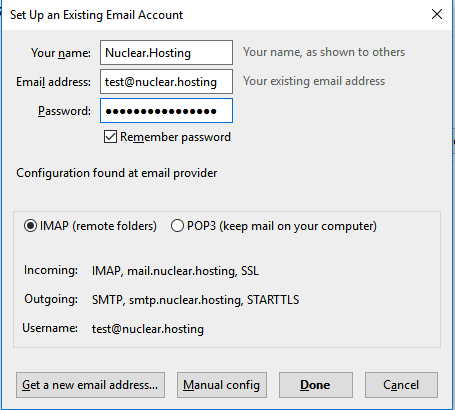

!!! note
	If you cannot get autoconfig working properly, make sure you have correctly configured appropriate DNS records in your domain DNS zone.

### How to configure Mozilla Thunderbird (manual configuration)

Mozilla Thunderbird email client manual setup instructions for receiving and sending emails.

The example counts with the IMAPS (secured) reception settings and sends SMTP over SSL over our SMTP server.

#### 1. Enter the base account details

 - **Your name:** the name for this email account
 - **E-Mail Address:** enter your email account address
 - **Password:** password to that email account
 - **Remember password:** check this option

Continue to next step by clicking on the ```Continue``` button.

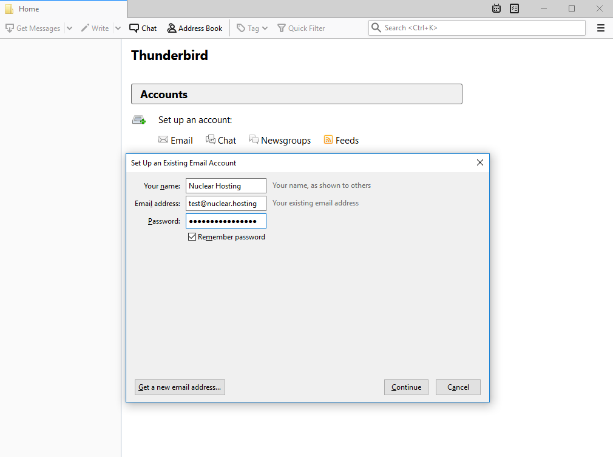

#### 2. POP3/ IMAP server configuration

Default loaded server details are probably not correct, so click on the ```Manual config``` button.

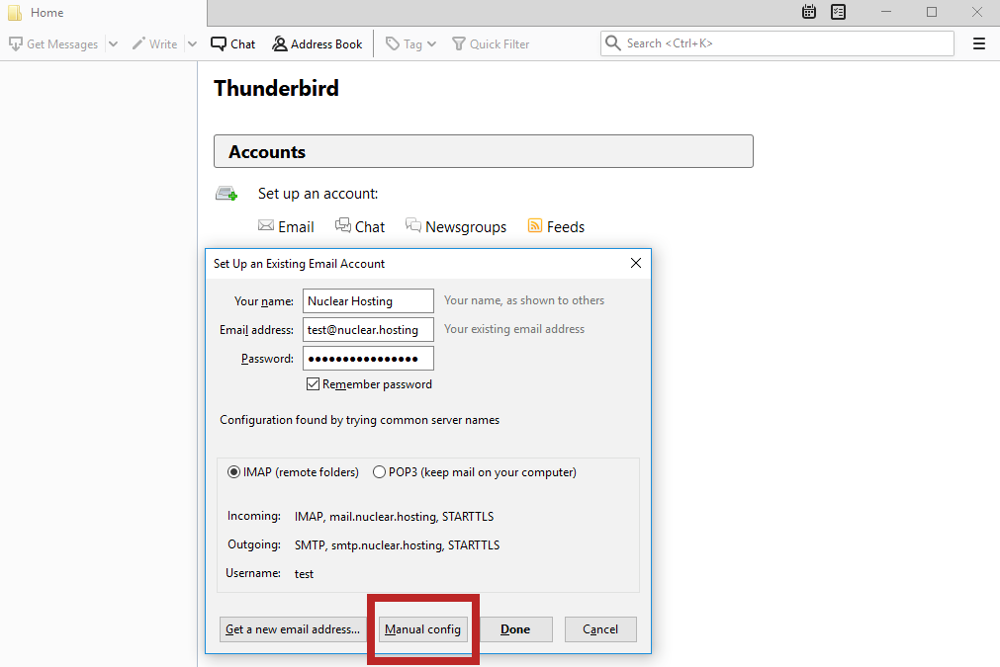

#### 3. POP3/ IMAP server configuration - manual config

Complete the form with these values (see the picture):

**Incoming:**

 - IMAP
 - **Server hostname:** mail.nuclear.hosting
 - **Port:** 993
 - **SSL:** SSL/TLS
 - **Authentication:** Normal password

**Outgoing:**

 - SMTP
 - **Server hostname:** smtp.nuclear.hosting
 - **Port:** 587
 - **SSL:** STARTTLS
 - **Authentication:** Normal password

**Username Incoming:** your full email address, ie johndoe@example.com

**Username Outgoing:** your full email address, ie johndoe@example.com

When you are done, click on the ```Done``` button.

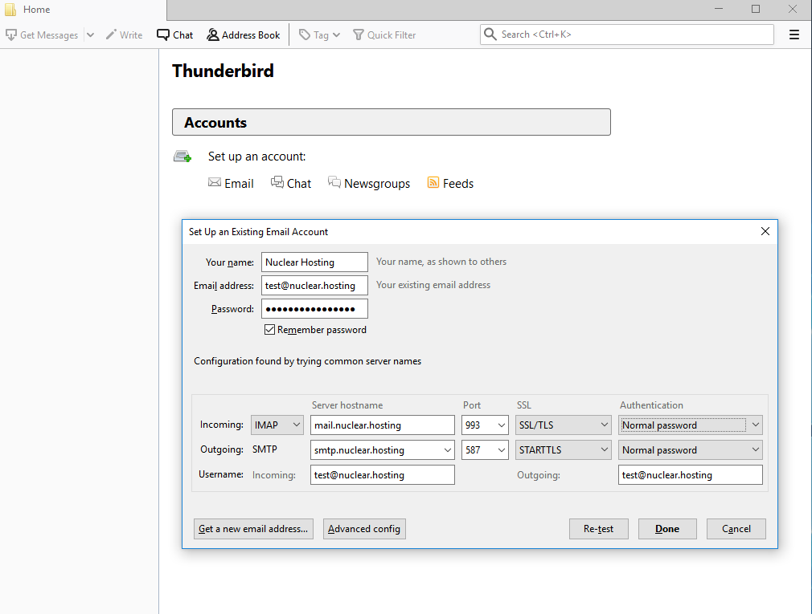

#### 4. You are done!

That's it! You are done, you have successfully configured your e-mail client Thunderbird to receive, send and manage your emails in your e-mail mailbox.

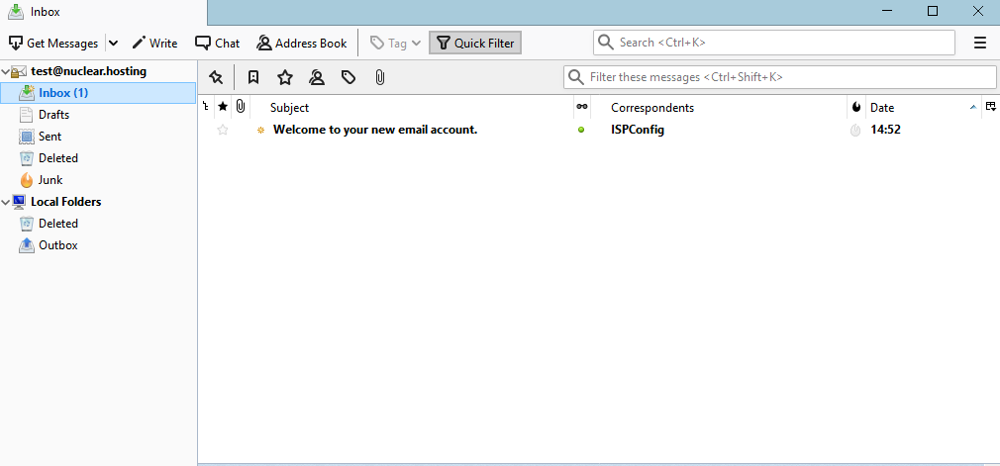

### How to configure Microsoft Outlook (auto-configuration)

#### 1. Add an account

Run the Microsoft Outlook application on your computer, click on the ```File``` and next ```Add account```. In the dialog click on the ```E-Mail Account``` and complete the form.

 - **Your Name:** enter your name
 - **E-mail Address:** your full email address, ie johndoe@example.com
 - **Password:** password to your email address
 - **Retype Password:** password to your email address

Click on the ```Next``` button.

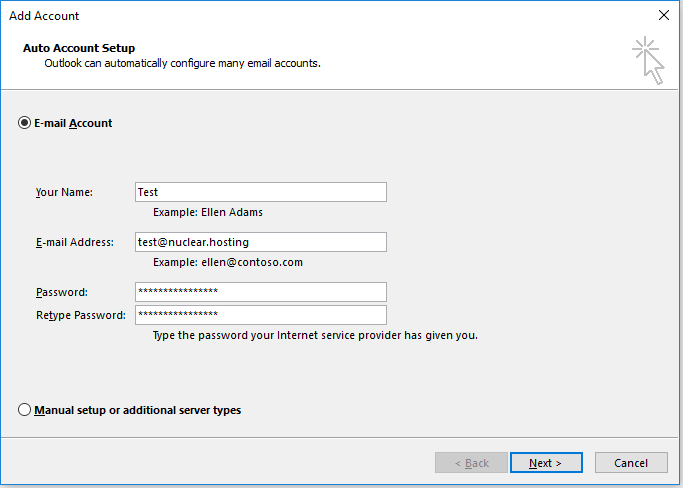

#### 2. Correct auto-configuration values

When the error message ```Cannot Log on the Server``` is appear, check the ```Change account settings``` box.

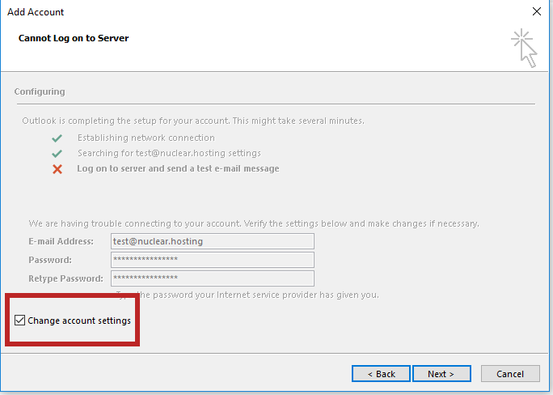

In the next window choose a ```POP or IMAP``` option and click on the ```Next``` button.

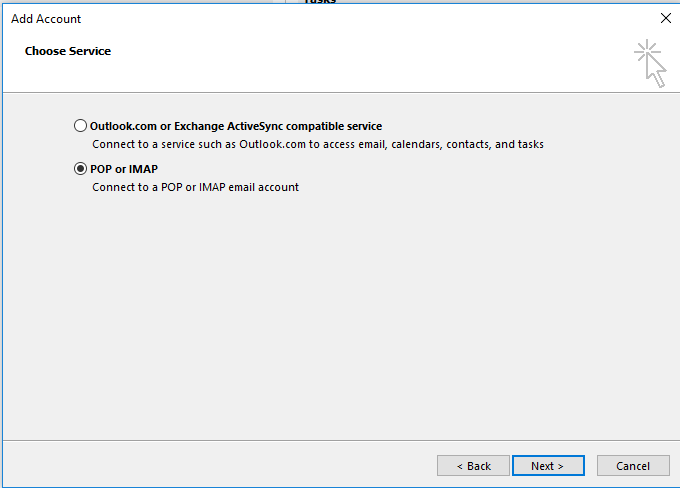

#### 3. Enter the base account details

Complete the form like on example bellow:

 - **Your name:** enter your name
 - **Email address:** your email address
 - **Account type:** IMAP
 - **Incoming mail server:** mail.nuclear.hosting
 - **Outgoing mail server (SMTP):** smtp.nuclear.hosting
 - **User name:** your full email address, ie johndoe@example.com
 - **Password:** password to your email address

Next, uncheck ```Require logon using Secure Password Authentication (SAP)``` option.

Next, click on the ```More Settings...``` button.

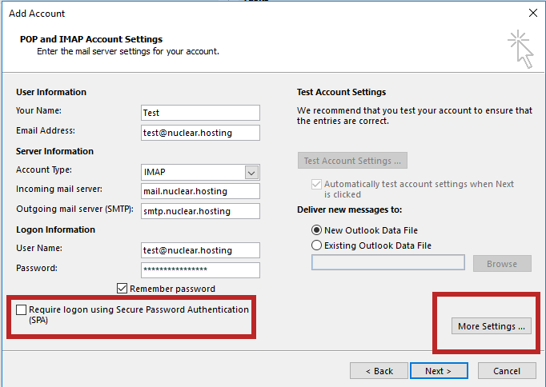

Click on the ```Outgoing server``` tab and check the option ```My outgoing server (SMTP) requires authentication``` and make sure option ```Use same settings as my incoming mail server``` is checked too. Continue by clicking on the ```OK``` button.

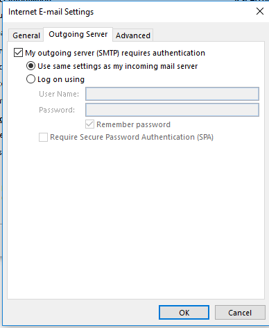

#### 4. Complete the configuration

Click on the ```Next``` button and wait until tests are completed and successful.

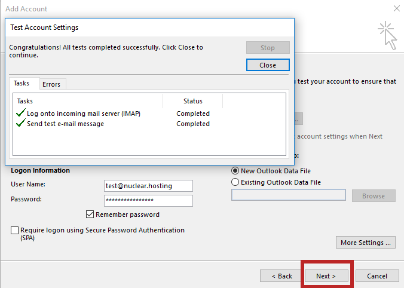

When all tests are completed sucessfuly, click on the ```Finish``` button.

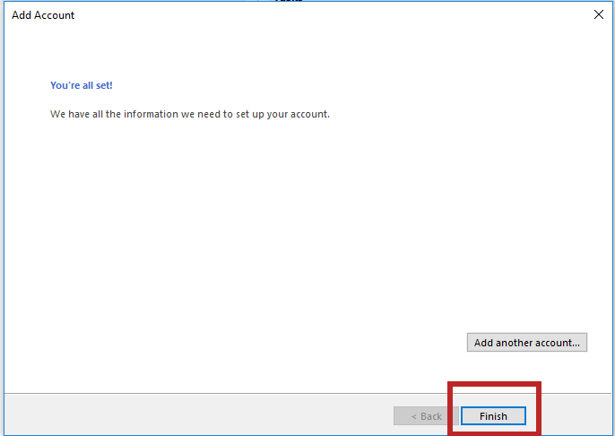

### How to configure Microsoft Outlook (manual configuration)

#### 1. Add an account

Run the Microsoft Outlook application on your computer, click on the ```File``` and next ```Add account```. In the dialog click on the ```Manual setup or additional server types``` and click on the ```Next``` button.

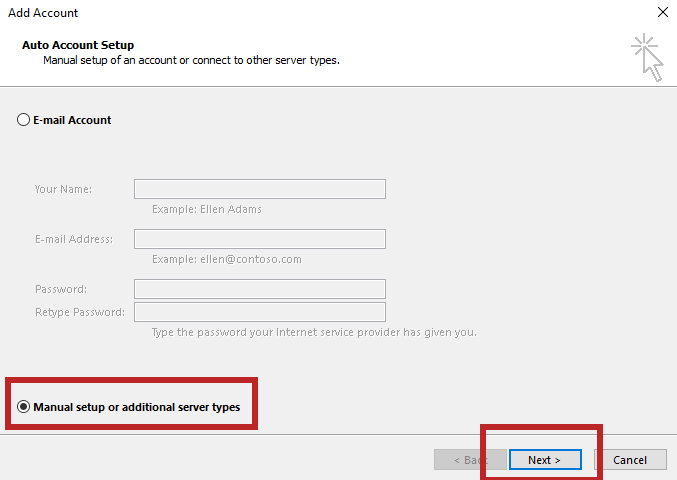

In the next windows choose a ```POP or IMAP``` option and click on the ```Next``` button.


#### 3. Enter the base account details

Complete the form like on example bellow:

 - **Your name:** enter your name
 - **Email address:** your email address
 - **Account type:** IMAP
 - **Incoming mail server:** mail.nuclear.hosting
 - **Outgoing mail server (SMTP):** smtp.nuclear.hosting
 - **User name:** your full email address, ie johndoe@example.com
 - **Password:** password to your email address

Next, uncheck ```Require logon using Secure Password Authentication (SAP)``` option.

Next, click on the ```More Settings...``` button.


Click on the ```Outgoing server``` tab and check the option ```My outgoing server (SMTP) requires authentication``` and make sure option ```Use same settings as my incoming mail server``` is checked too. Continue by clicking on the ```OK``` button.


#### 4. Complete the configuration

Click on the ```Next``` button and wait until tests are completed and successful.


When all tests are completed sucessfuly, click on the ```Finish``` button.


### How to configure Windows (Live) Mail (auto-configuration)

Instructions to configure Windows Mail client using Auto-Configuration.

#### 1. Add an account

Run the Windows Mail application on your computer, click on the ```Accounts``` and next ```Add account```. In the dialog choose ```Other account```.

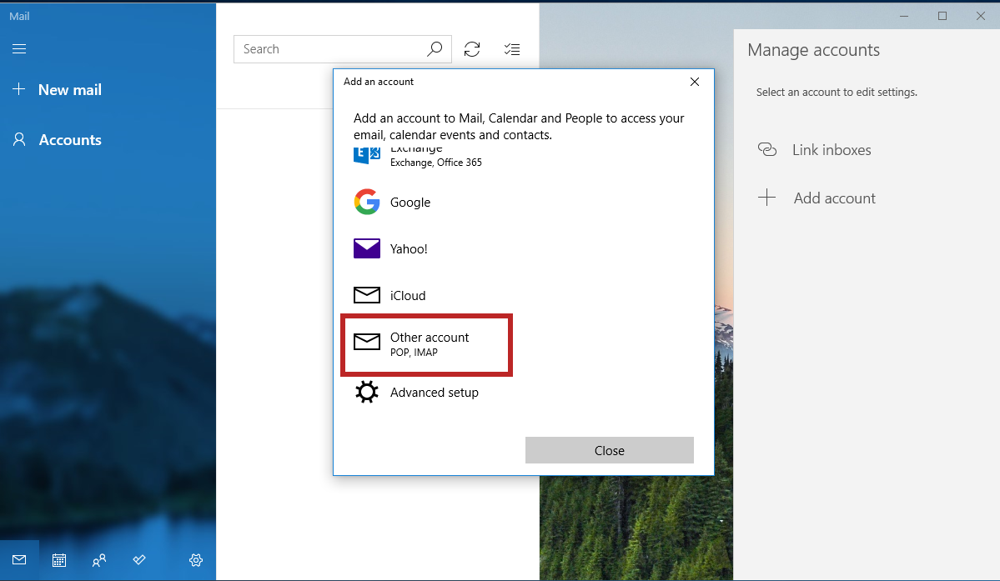

#### 2. Enter the base account details

Enter your name, email address and the password for that email you set in the [Hosting Control Panel](https://my.nuclear.hosting) and click on the ```Sign in``` button.

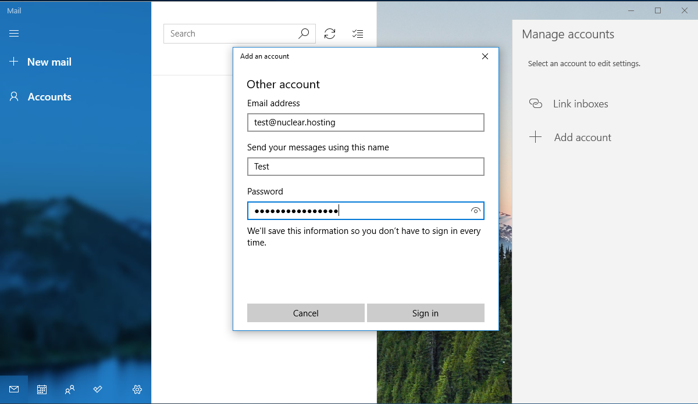

#### 3. Finish configuration

You are done! All is configured. Now just click on the ```Done``` button.


### How to configure Windows (Live) Mail (manual configuration)

Windows Mail email client manual setup instructions for receiving and sending emails.

The example counts with the IMAPS (secured) reception settings and sends SMTP over SSL over our SMTP server.

#### 1. Add an account

Run the Windows Mail application on your computer, click on the ```Accounts``` and next ```Add account```. In the dialog choose ```Advanced setup```.

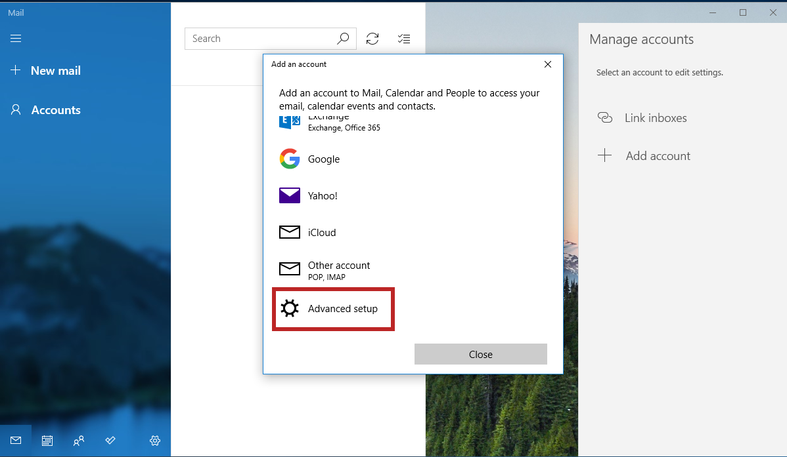

In the next windows click on the ```Internet email```.

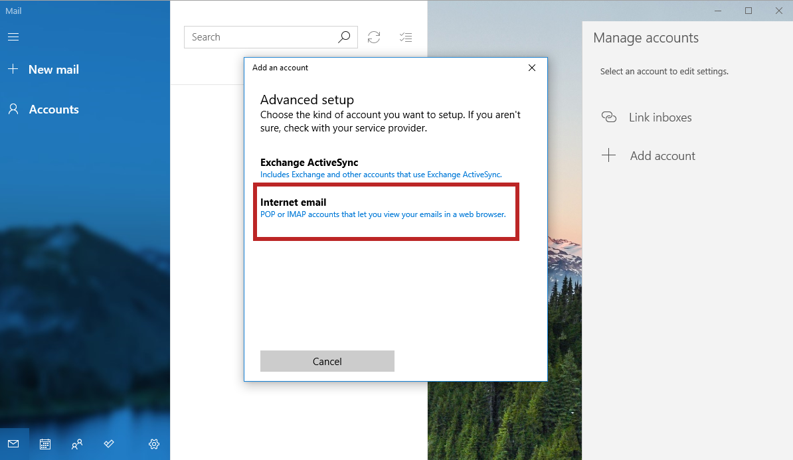

#### 2. POP3/ IMAP server configuration

Complete the form with values below (see the picture):

- **Email address:** your full email address, ie johndoe@example.com
- **Username:** your full email address, ie johndoe@example.com
- **Password:** password to your email address
- **Account name:** your account name
- **Send your messages using this name:** your name
- **Incoming email server:** mail.nuclear.hosting
- **Account type:** IMAP4
- **Outgoing (SMTP) email server:** smtp.nuclear.hosting
- **Outgoing server requires authentication:** check / keep checked
- **Use the same username and password for sending emails:** check / keep checked
- **Require SSL for incoming emails:** check / keep checked
- **Require SSL for outgoing emails:** check / keep checked

When you are done, click on the ```Sign in``` button.

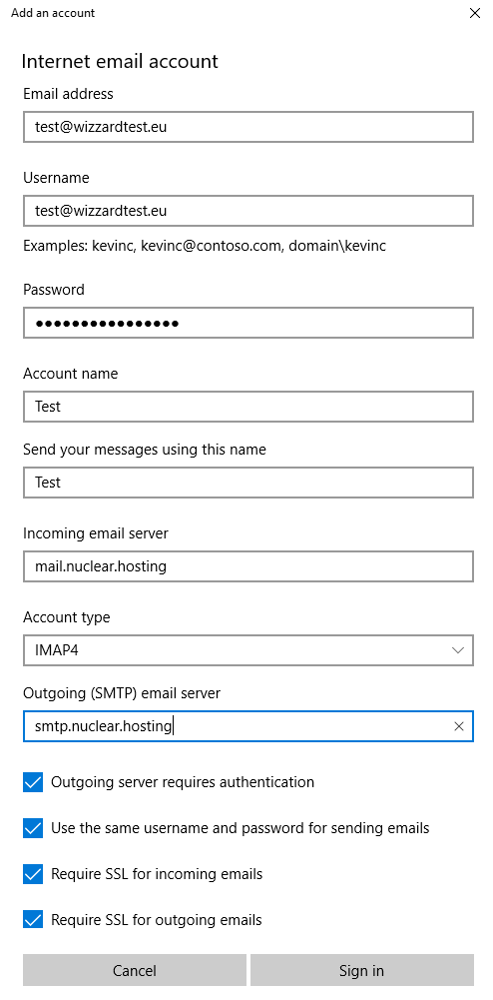

#### 3. Finish configuration

You are done! All is configured. Now just click on the ```Done``` button.

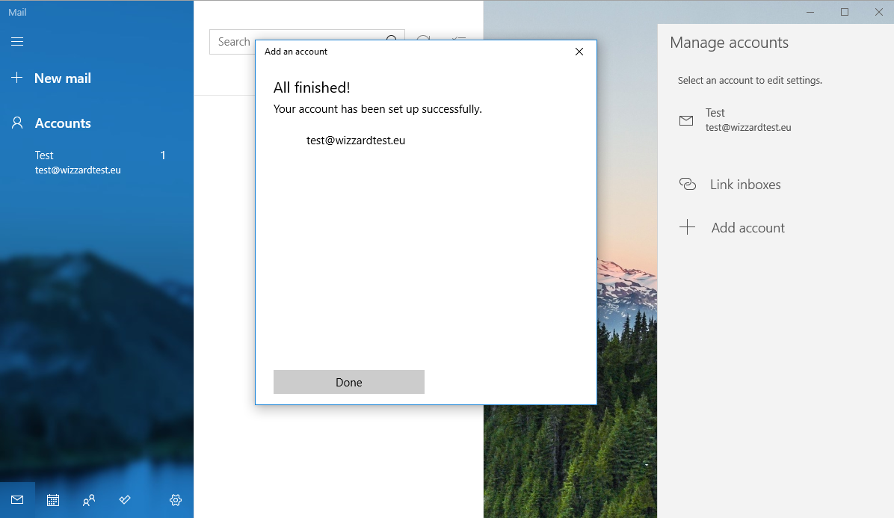

### How to configure Apple Mail

Apple Mail email client manual setup instructions for receiving and sending emails.

The example counts with the IMAPS (secured) reception settings and sends SMTP over SSL over our SMTP server.

Apple Mail does not support auto-configuration.

#### 1. Create a new account

Run the Mail application on your computer. In it, go to the ```Mail``` menu and choose ```Add Account...```.

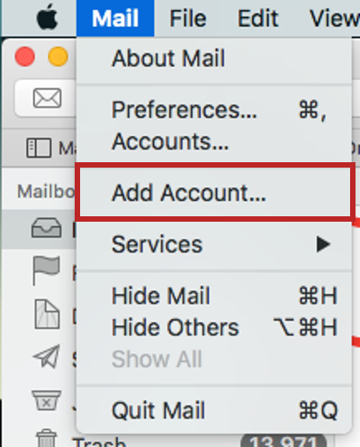

In the next dialog, select the ```Other Mail Account...``` option and confirm.

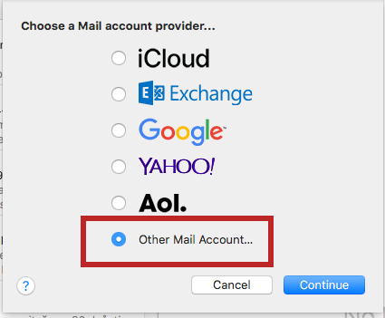

#### 2. Enter the base account details

Enter your name, email address and the password for that email you set in the [Hosting Control Panel](https://my.nuclear.hosting) and click on the ```Sign in``` button.

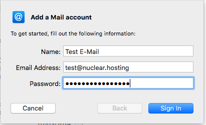

#### 3. POP3/ IMAP server configuration

Select the server type, in our case we use IMAP. Enter the incoming and outgoing server names:

**Incoming Mail Server:** mail.nuclear.hosting
**Outgoing Mail Server:** smtp.nuclear.hosting

Continue to next step by clicking on ```Sign In```.

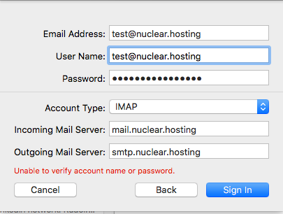

That's all! You are done!

## Antispam settings

You can turn on antispam control for each mailbox in which incoming messages are stored (ie, which are not redirected).

An incoming email that will be considered spam will be marked with ```***** SPAM *****``` at the beginning of the subject of the email. For example, based on this label, you can set up your email client to delete such messages, store them in a special folder, or use spam filtering directly on the server (sieve filters).

We have predefined antispam policies which are [described here](#antispam-policies). You can setup antispam policy for whole domain or individualy for mailboxes. Every mailbox can have different antispam policy. You can also turn off antispam filtering for any mailbox.

!!! hint
	You can change antispam policy settings anytime.

### How to change Antispam policy or antispam settings

Antispam policy changes can by done by mailbox edit. More information how to change mailbox settings (either antispam policy) follow steps described in [How to change mailbox settings](#how-to-change-mailbox-settings).

## DKIM & SPF

### DKIM

DKIM (DomainKeys Identified Mail) is a solution to increase the trustworthiness of emails sent using the additional source message identification. It uses the combination of the DNS record (TXT) and the corresponding header with the DKIM signature in the sent message. Successful verification of these two factors is for the receiving SMTP server signal that the sender is unlikely to be tempted and has control over the domain from which the message is sent.

#### DKIM setting Up

Nuclear.Hosting allows you to set up DKIM signatures for all e-mail message sources. It means from PHP scripts from webservers, from outgoing SMTP server for e-mail clients (smtp.nuclear.hosting) and from [webmail](https://webmail.nuclear.hosting).

##### 1. DKIM for messages sent from PHP / webserver

Activation is automatic - when you create a new webhosting for your domain (when you add a domain to webserver in Hosting Control Panel) new DKIM signing key is generated and if you are using our DNS NameServers, appropriate DNS settings are made automatically. If you are not using our DNS Nameservers, instructions on how to set-up your DNS zone to DKIM can work correctly are sent to you by email.

#### 2. DKIM for messages sent from outgoing SMTP server

DKIM activation for outgoing SMTP server can be made in your [Hosting Control Panel](https://my.nuclear.hosting) account when you creating / adding a new domain into e-mail servers or anytime later in domain edit.

If you are adding a new domain into e-mail servers just click on the ```DomainKeys Identified Mail (DKIM)``` button. If you want to enable DKIM on already added domain, navigate to ```Email``` section in [Hosting Control Panel](https://my.nuclear.hosting), in the left-hand menu click on the ```Domain```, find your domain where you want to activate DKIM, click on it and in the edit form click on the ```DomainKeys Identified Mail (DKIM)``` button.

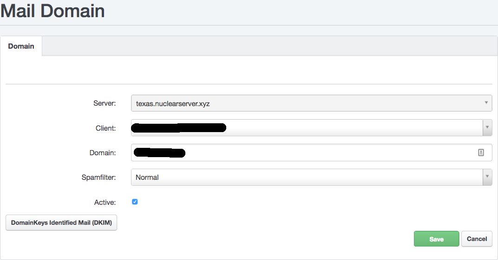

After click on the ```DomainKeys Identified Mail (DKIM)``` button the new part of the form is shown. Now check the box ```enable DKIM``` and just click on the ```Generate DKIM Private-key```. The empty fields are automatically filled with auto-generated values.

!!! note
	Do not type / write anything into ```DKIM Private-key``` field.

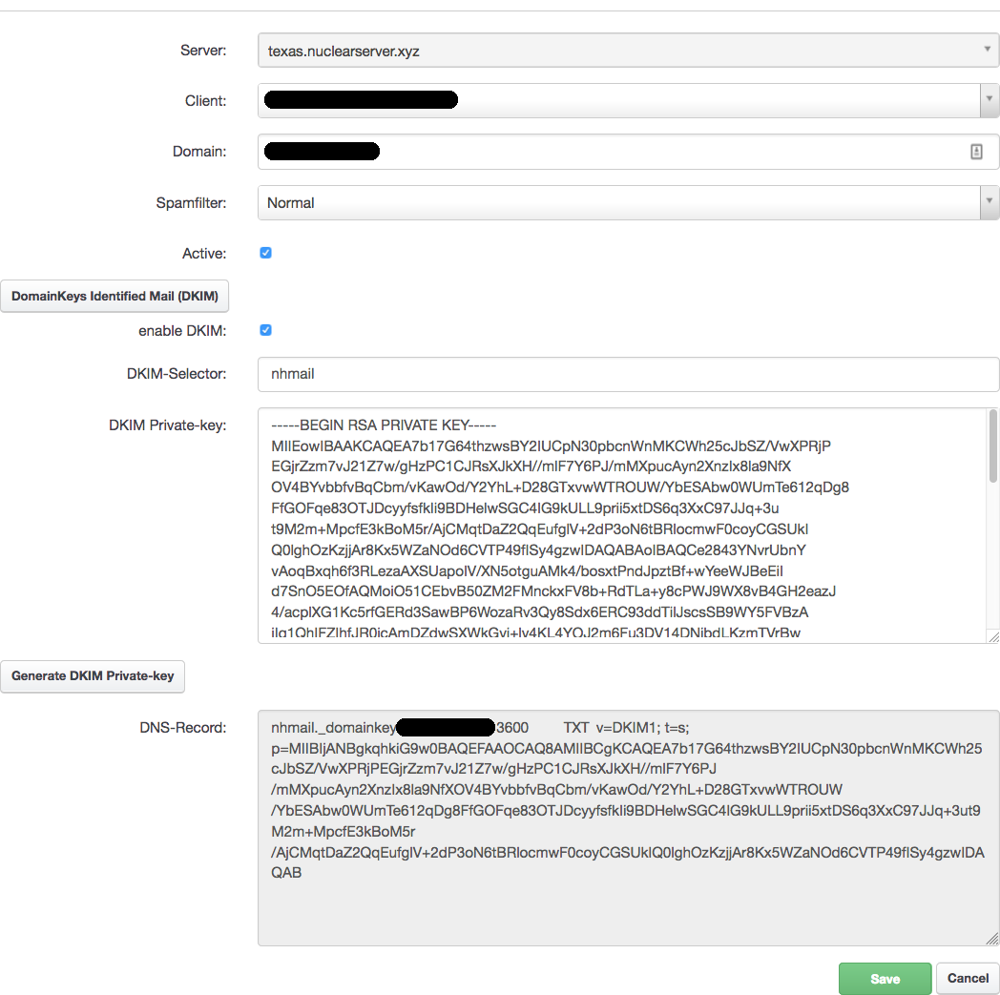

If you are using our DNS Nameservers you don't have to do nothing more and just click on the ```Save``` button. DNS Records for DKIM will be setted up automatically.

!!! info
	DNS zone changes take effect up to 24 hours.

If you are **not using our DNS NameServers** you have to copy the content of ```DNS-Record``` field before you submit the form and add this DNS record to your domain DNS zone manually. DNS record is a TXT record. When you copied DNS record value, just click on the ```Save``` button.

#### 3. DKIM for messages sent from webmail

To enable DKIM signatures for emails sent from Webmail you just have to enable DKIM as described in step above (```2. DKIM for messages sent from outgoing SMTP server```). No other special settings are required.

### SPF

The Sender Policy Framework (SPF) is another solution to ensure validation of an e-mail message that helps in detecting spam. Its principle is to verify the source of the sent message (the sending server) against the defined servers that are allowed to send messages from that domain. Authorized servers (their domain names or IP addresses) are listed in the SPF record in the DNS zone of that domain (SPF record is one of the types of TXT records). If the source of the message is none of the legitimate resources, the receiving SMTP server will handle the message as defined in the record and its rules (for example, the message will refuse to accept or filter it as spam).

SPF checks are not performed by all receiving servers on the Internet, what they do is a minority. However, it can be assumed that their number will gradually increase. Our receiving SMTP servers do not currently perform SPF checks, however, we take SPF into account when evaluating antispam messages.

#### SPF setting up

To use SPF, you just have to for your domain to set the appropriate DNS record. It is necessary to specify **all possible sources** of the sent messages from the given domain and the behavior if the sending source did not meet the validation conditions.

Within our Nuclear.Hosting services, messages from the domain can be sent from four different sources:

 - webserver where is domain hosted (i.e. from PHP script)
 - outgoing SMTP server for e-mail clients (smtp.nuclear.hosting)
 - webmail
 - e-mail storage server - in case you are using forwarding or copies on your mailbox (however, due to SPF and potential complications with delivery, we do not recommend to use e-mail forwardings / copies)

!!! hint
	If you are using our DNS Nameservers the SPF record is created for your domain automatically.

The general Nuclear.Hosting SPF record you can use, if you are not using our DNS Nameservers is:

```
v=spf1 mx a include:spf.nuclear.hosting ~all
```

What does this record means, you can find in the section bellow.

#### SPF Record explanation

The SPF record (TXT) consists of three parts: From the mark that this record is SPF (```v=spf1```), the list of output sources of the messages and the conclusion specifies the behavior in the case of an unauthorized source.

Several settings - mechanisms - can be used to define permitted resources. The most common are ```a``` (A or AAAA domain record), ```mx``` (MX domain record), ```ip4``` (IPv4 address or address range), ```ip6``` (IPv6 address or address range), ```ptr``` (reverse record) and ```include``` (retrieves another SPF record).

The decision if the source fails to validate can be specified in one of four ways: ```+``` (pass), ```-``` (fail), ```~``` (softfail) and ```?``` (neutral).

Bellow you can find a few SPF record examples:

```v=spf1 ip4:1.2.3.4 ?all``` - only allowed sources is IP address 1.2.3.4; resolution neutral

```v=spf1 a mx ~all``` - allowed sources are IP addresses / servers, which are A, AAAA and MX records of this domain; resolution softail which means source did not pass the test but decision is not final

```v=spf1 ip6:2001:41d0:303:5d3b::400 a -all``` - allowed sources are IPv6 address 2001:41d0:303:5d3b::400 and A + AAAA records of this domain; resolution fail = source do not pass test, the message will be declined

```v=spf1 a:example.com ?all``` - allowed source is only A record of the domain example.com; resolution neutral

```v=spf1 a mx include:spf.nuclear.hosting ~all``` - allowed sources are current domain webserver (its A DNS record), domain MX server and all our servers listed in record ```spf.nuclear.hosting```; resolution softfail

A more detailed information about SPF you can find in [SPF docummentation](http://www.openspf.org/SPF_Record_Syntax).

## Antispam Policies

Every incomming email message is tested by several tests to identify or even to reject junk or otherwise defective correspondence, before is being delivered into mailbox. Performing some tests depends on the recipient's mailbox settings.  The following antispam tests are performed:

 - Public Spam Blacklists
 - Sender Domain Existence - Detects the ability to deliver a message to the sender's domain (MX or A records); if such delivery is not possible, the message is declined
 - Delivery option to recipient's mailbox - rejects messages directed to nonexistent or out of quota mailboxes
 - Greylisting
 - Attachment File Extensions
 - Antivirus
 - Antispam

Some of these tests are described below in detail.

Our SMTP servers receive emails of up to about 100 MB.

If for some reason the message is rejected by our servers, the client (sending server) who is trying to send the message is informed (SMTP code 5xx). It is his duty to inform the original sender of the message. Therefore, it is not possible for a message in your mailbox "to be lost". The sender should know about each case of non-delivery of the sent message and the reason for this non-delivery.

!!! note
	The secondary / backup e-mail server (```mx2.nuclear.hosting```) is providing the same tests as well as primary e-mail server.

### Public Spam Blacklists

Black lists (blacklists) are publicly updated lists of IP addresses of computers from which problematic mail is being sent. This is a very important tool in the fight against junk mail. If the SMTP connection is made from an IP address kept in one of the blacklists, the receiving SMTP servers are rejecting the 553 error code. We use these blacklists:

 - zen.spamhaus.org,
 - bl.spamcop.net,
 - dev.null.dk,
 - pbl.spamhaus.org,
 - sbl.spamhaus.org,
 - cbl.abuseat.org,
 - dsn.rfc-ignorant.org,
 - sbl-xbl.spamhaus.org,
 - cbl.abuseat.org,
 - combined.rbl.msrbl.net,
 - rabl.nuclearelephant.com

Used blacklists may change over the time.

### Greylisting

On all our receiving SMTP servers we are using greylisting. This anti-spam method assumes that spammers' SMTP servers will not make other SMTP connections if the first connection is rejected.

The first connection from an unknown sender is rejected (the email address of the sender and the IP address from which the SMTP connection was made) are taken into account. Rejection is by SMTP code that informs about temporary error (4xx) and standard SMTP server compliance standards (RFC 2821) is a signal for later attempt to deliver the message. After the first rejection of the sender, the normal connection is possible 6 minutes later, with a 24-hour interval without rejection (if more than one connection continues, this period is continuously extended).

This solution may delay the reception of the message (the length of the delay depends on the SMTP server's sender settings - usually a few minutes), however, it can prevent most of the spam that goes to users' mailboxes.

!!! hint
	You can easily turn off Greylisting antispam protection for any particular e-mail mailbox. Navigate to e-mail mailbox edit in your Hosting Control Panel and just uncheck ```Enable greylisting```.

### Forbidden Attachment File Extensions

Another check performed by the SMTP server on an incoming email is checking attachments. If the email contains an attachment file with any of these file extensions, such email will not be accepted and will be rejected.

```bat,chm,cmd,com,cpl,dll,exe,hlp,hta,js,pif,reg,scr,shs,vbe,vbs,vxd,wsf,wsh```

### Outgoing SMTP server

SMTP server smtp.nuclear.hosting serves (physical and real) users to send regular mail from their mail clients.

Outbound messages are scanned by antivirus control and by checking the forbidden attachment terminals. Outgoing messages are also controlled by antispam. From this server, you can send an email of up to 30 MB.

!!! important
	This server is not intended for sending bulk messages, automated sending (from some devices), or sending messages from web applications.

**The amount of messages sent per user is limited to 60 messages per hour for Free membership and to 300 messages per hour for VIP messages** (including messages sent from webmail are included), and a copy is also considered as a separate message. If the user exceeds this limit, the SMTP server will reject the next attempt to send it for the remainder of the hour with the 5xx error code. At the same time, the maximum number of recipients is limited in one message (per 100). These limits are designed to prevent undesired use of the server, which could lead to the delay of sending other users' messages. For sending messages from web applications use PHP mail() function.

## Troubleshooting e-mails problems

!!! note
	Problems with receiving or sending mail from mail clients are most often caused by security measures on your computer or network. Typically, this is set up by firewall, antivirus, or network restrictions (for example, a ban on sending mail over SMTP servers located outside the network).

If you have problems connecting to the server for incoming or outgoing mail, we recommend the following steps:

 - Make sure your account settings are correct in your email client. For instructions on how to set up a mail client, see the [Mail Client Settings](#how-to-setup-e-mail-client-to-access-my-mailbox). You can easily verify the login and password for your e-mail by logging in to [webmail interface](https://webmail.nuclear.hosting).
 - Verify that the connection is not blocked by a program on your computer - a firewall or antivirus. Often, the connection blocks antivirus after it has been updated or turned on its component to control incoming emails.
 - Verify that the connection is not blocked on your network or by your ISP. For example, some ISPs are forbidding sending messages over sending SMTP servers located outside their network.

### Issues with SMTP over SSL

The mail client can say when sending mail: ```Could not connect to smtp.nuclear.hosting SMTP server using STARTTLS, since it does not offer STARTTLS in EHLO response.```

This problem is caused by a transparent SMTP proxy between the SMTP client and our server. For example, SMTP proxies use antiviruses on MS Windows (eg, AVG). In this case, antivirus configuration should be changed.

### Problem receiving and sending mail to your domain

If a message fails to deliver, the sender should be informed by an error message (for example, a failure notice, delivery failure, etc.). The message may be delivered to the sender several days after sending the message (depending on the reason for the non-delivery of the message and the SMTP server sending the message).

This report usually lists the reason for non-delivery. According to this information, the sender can arrange or contact the sender of the SMTP server through which he sends the mail. If the sender does not receive the message and the message does not occur, you should also contact the SMTP server administrator first. This will either solve the problem or gather the information needed for the next solution (for example, for the recipient's SMTP administrator).

### Sent messages are referred to as spam

Inbound messages are evaluated by the recipient's mail system. The exact reason why a message is considered as unsolicited is primarily to find out there. Then you can take action and make adjustments to resolve the problem.

The reasons why this happens can be many (including a combination of several different) as well as possible solutions.

In general, you can increase the credibility of the sent messages by setting DKIM and SPF, but it is not a universal solution. The cause must always be addressed specifically.

## Restrictions of using e-mails

### Number of mailboxes

The number of mailboxes is not limited, yet we have set the following rules to use the mailboxes for fair use:

 - Only create boxes for your use, not for other entities and businesses
 - Do not use mailboxes as e-mail archives; for this, it is better to use local folders on your computer
 - Remove mailboxes that you no longer actively use (for example, you have not logged in to them for several months)

### Sending emails from PHP scripts

From PHP, emails can be sent using PHP ```mail()``` function. Also, you can not sent via our SMTP server from PHP scripts. It is also forbidden to send via foreign SMTP servers, but if you need to send emails from PHP via foreign SMTP servers, we can set an exception for a specific domain for a specific SMTP server on request.

Sending emails is limited:

 - 60 emails in 60 minutes, 360 total per 24 hours
 - 1800 emails in 60 minutes, 3600 total per 24 hours.

If you reach this limit, the ```mail()``` function returns FALSE, so you can immediately see that the limit has been reached and you can send another batch of emails later.