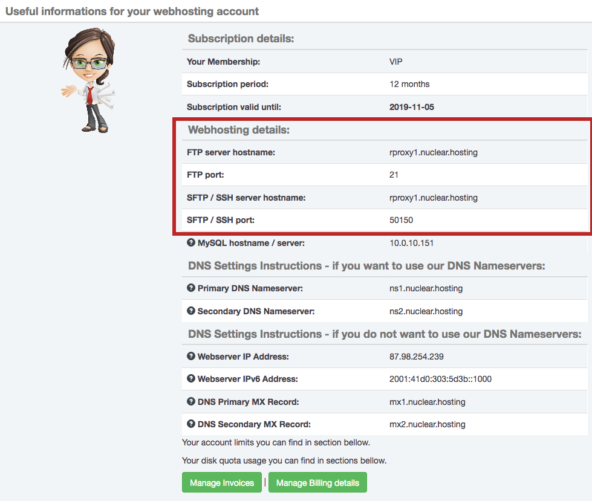
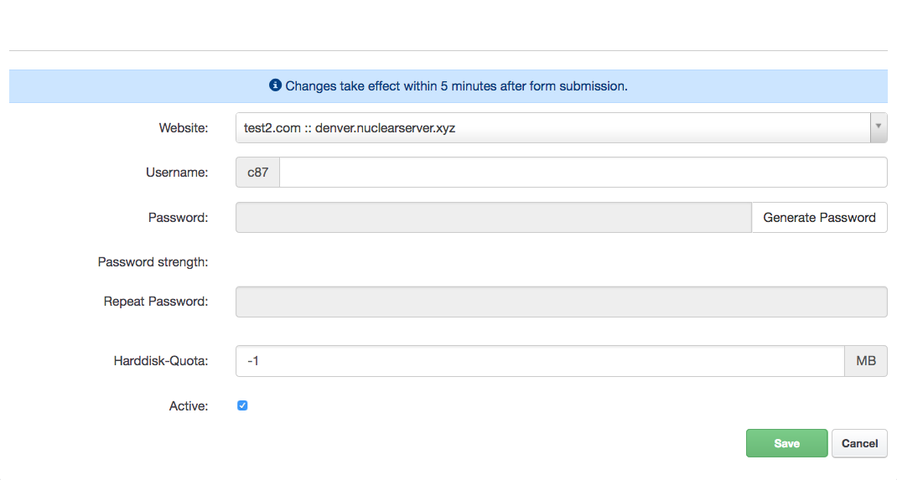
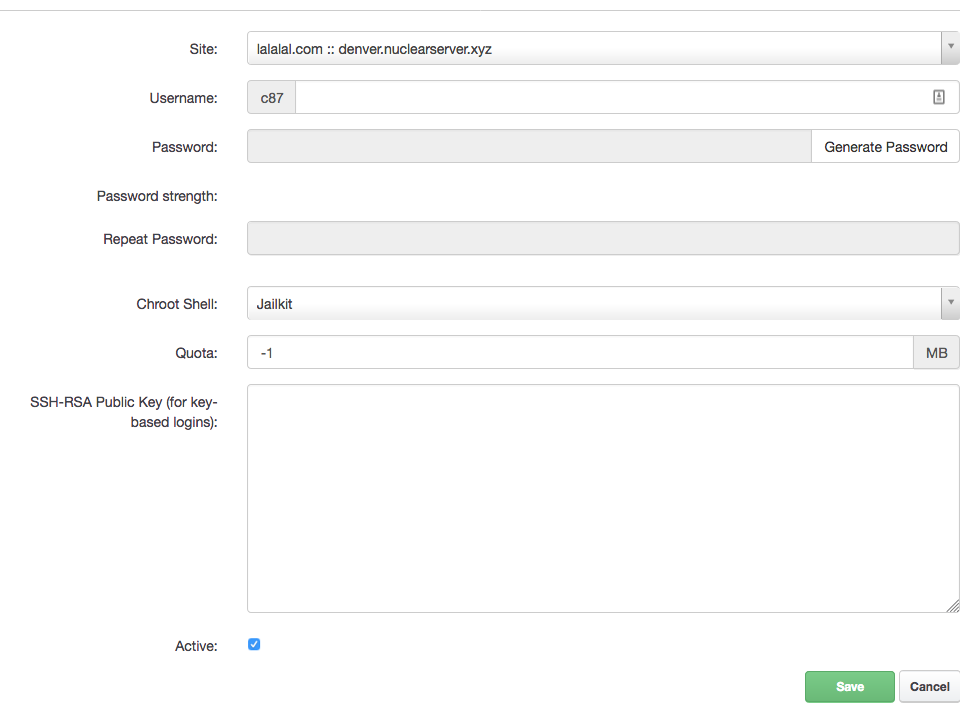

# FTP / SFTP, connecting to server, transfer files to server

## How to connect to FTP

!!! important
	We do not recommend to use FTP, rather use SFTP/SCP - it is much more safer.

!!! note
	SFTP/SCP is available only for VIP Membership.

File transfer to the webserver is possible via FTP or SFTP/SCP (only for VIP members). We recommend using SFTP/SCP to ensure data and password security. For connecting use any program for work with FTP or SFTP/SCP (eg FileZilla or WinSCP). To log on to the server you will need to server hostname, port, username and password.

The **server name / hostname** you can find on the Dashboard in your Hosting Control Panel account.

!!! note
	The server hostname may be different for your account than in this article. Everytime use hostname from your Dashboard.

	FTP port is always 21.



The **username and password** you can create ([How to create FTP account](#how-to-create-ftp-account)) in your Hosting Control Panel.

!!! note
	We do not officialy provide a WebFTP interface to access to FTP accounts. We recommend to use a specialized FTP/SFTP software (Filezilla, WinSCP, etc.).

### How to setup FTP client

The exact configuration depends on your chosen FTP client. In general, you need FTP username, password ([How to create FTP account](#how-to-create-ftp-account)) and server hostname. **FTP server port is 21**. Our FTP servers supports only **pasive mode**, so in your client configuration choose **pasive mode**.

!!! hint
	New FTP account is created within 5 minutes.

## How to connect to SFTP

Before you can connect to SFTP/SCP or even to use ```rsync```, you have to [create a new SFTP / SSH account](#how-to-create-sftp-scp-account) in your [Hosting Control Panel account](https://my.nuclear.hosting).

!!! note
	SFTP/SCP/SSH is available only for VIP Membership.

You will also need a **server hostname** and **port**. Server hostname you can find on your Dashboard page after logging in to Hosting Control Panel. The port can be found in the SFTP/SSH accounts overview table in Hosting Control Panel - ```Sites``` - ```Shell-User```. The credentials to your FTP and SFTP are different - they are not the same!

For proper connection you also need to use a software (client) which supports SFTP/SCP protocol. For example Filezilla or WinSCP. If you are familiar with command-line and you are a Linux or MacOS X user, you can also use CLI SSH/SFTP client.

## How to create FTP account

A new FTP account can be created in your [Hosting Control Panel account](https://my.nuclear.hosting).

!!! note
	Number of FTP accounts is limited for Free Membership and Unlimited for VIP Membership.

Log in to your [Hosting Control Panel account](https://my.nuclear.hosting), navigate to ```Sites``` section and in the left-hand menu click on the ```FTP-Accounts```. In the list you can see all your already created FTP accounts. To create a new one, just click on the ```Add new FTP-User```.

In the form fill the values:

 - **Website:** Select a website for which you want to create a FTP account.
 - **Username:** FTP username (every username is automatically prefixed)
 - **Password:** enter your strong password (or use automatically generated by clicking on the ```Generate Passowd``` button)
 - **Repeat password:** enter the same password like before (automatically generated password is pre-filled automatically)
 - **Harddisk-Quota:** you can limit harddisk quota for newly created user. For unlimited quota enter ```-1```
 - **Active:** you can set this FTP user active or inactive

When you are done, just click on the ```Save``` button.



!!! note
	New FTP account will be activated within 5 minutes.

## How to edit FTP account settings

There is a few options you can change for every single FTP account. To change FTP account settings log in to your [Hosting Control Panel account](https://my.nuclear.hosting), navigate to ```Sites``` section and in the left-hand menu click on the ```FTP-Accounts```. In the list of created FTP accounts click on one you want to change settings for.

In the form you can change:

 - Website which FTP account belongs to
 - Username
 - Password
 - Harddisk Quota
 - Active/Inactive status

On the ```Options``` tabs is several more options you can change:

 - **FTP Account directory / location:** directory where this FTP account points to (you cannot point FTP account outside of your base domain folder). If you point your FTP account to specific directory, there will be no access outside of this directory.
 - **Expiration:** you can set FTP account expiration date. After this date FTP account will be no more active.

 All changes will be applied after you click on the ```Save``` button.

## How to create SFTP/SCP account

A new SFTP/SCP/SSH account can be created in your [Hosting Control Panel account](https://my.nuclear.hosting).

!!! note
	SFTP/SCP/SSH is available only for VIP Membership.

Log in to your [Hosting Control Panel account](https://my.nuclear.hosting), navigate to ```Sites``` section and in the left-hand menu click on the ```Shell-User```. In the list you can see all of your previously created SSH accounts. To add a new one click on the ```Add new Shell-User```.

In the form fill the values:

 - **Website:** Select a website for which you want to create a SFTP/SSH account.
 - **Username:** SFTP/SSH username (every username is automatically prefixed)
 - **Password:** enter your strong password (or use automatically generated by clicking on the ```Generate Passowd``` button)
 - **Repeat password:** enter the same password like before (automatically generated password is pre-filled automatically)
 - **Chroot Shell:** Jailkit (*cannot be changed*)
 - **Harddisk-Quota:** you can limit harddisk quota for newly created user. For unlimited quota enter ```-1```
 - **SSH-RSA Public Key:** if you want to use SSH key based authentication instead of password based authentication, enter your Public SSH RSA key.
 - **Active:** you can set this SFTP/SSH user active or inactive

When you are done, just click on the ```Save``` button.

