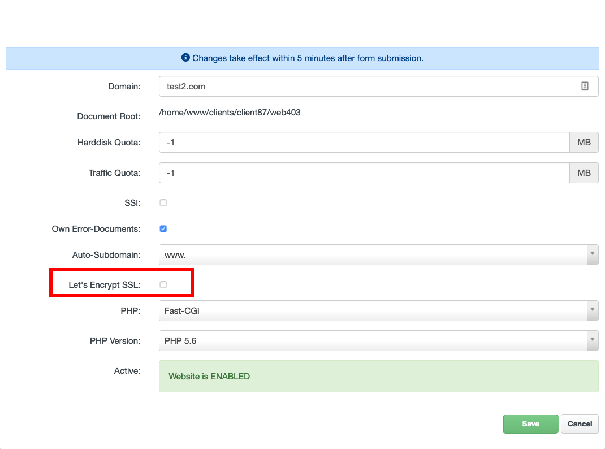

# HTTPS & Secured (Encrypted) Access to Website

## Conditions and restrictions of Let's Encrypt SSL Certificates

[Let's Encrypt](https://letsencrypt.org/) certification authority provides basic trusted SSL certificates for free. Their use on our hosting has several technical conditions and limitations:

 - The appropriate domain **must have our nameservers set** (in the appropriate domain registry, not only DNS records of type NS) and this state must be overwritten in the Internet (ie after fresh settings of the nameservers have to wait for the change to take effect - typically at least one day) or the domain **must have A & AAAA DNS records configured and pointed to our webservers**, as directed by the [Hosting Control Panel](https://my.nuclear.hosting). This is because of the automatic domain verification when the certificate is issued, both new and renewal. The same applies to all aliases that are automatically included in the certificate.
 - A **maximum of 50 certificates** can be issued per domain and its subdomains; the same overall limit applies to the number of certificates issued per week (issuing a new certificate, regenerating and extending an existing certificate).
 - A **maximum of 5 certificates per week** can be issued for a particular domain or subdomain (including regeneration or renewal).
 - A single certificate can contain a **maximum of 100 domain names** (SAN for aliases).
 - Wildcard Let's Encrypt certificates are not supported yet.

Issuing Let's Encrypt certificates does not always work reliably (it is a non-guaranteed third-party service). Certificate issuance is processed once per minute. If the certificate cannot be issued, Let's Encrypt option in the [Hosting Control Panel](https://my.nuclear.hosting) is automatically disabled.

!!! note
	Let's Encrypt certificate will be set up within 15 minutes.

Let's Encrypt certificates are automatically renewed 30 days before their expiration. If the extension is unsuccessful for any reason, we do not perform any automatic attempts again. However, there is enough time for manual extension.

### How to activate SSL Let's Encrypt certificate:

To issue a new SSL Let's Encrypt certificate go to your [Hosting Control Panel](https://my.nuclear.hosting) account, navigate to "Sites" and in the left-hand menu click on the "Websites". From the list of your domains select that one, where you want to issue a new Let's Encrypt certificate.

Next step is just mark / check the ```Let's Encrypt SSL``` option and click on the ```Save``` button.



!!! important
	Take special care to meet all SSL Let's Encrypt requirements (see above).

### How to exclude specific Alias Domain or Sub-Domain from Let's Encrypt SSL certificate:

If you have configured multiple alias sub-domains or alias domains and you want exclude them from the SSL Let's Encrypt Certificate from any reason, you can do that in the [Hosting Control Panel](https://my.nuclear.hosting).

Just navigate to editation page of specific alias domain or alias sub-domain and check the ```Don't add to Let's Encrypt certificate``` option and click on the ```Save``` button.

!!! note
	Exclude alias domain or alias sub-domain is preferred before the actual SSL Let's Encrypt activation.