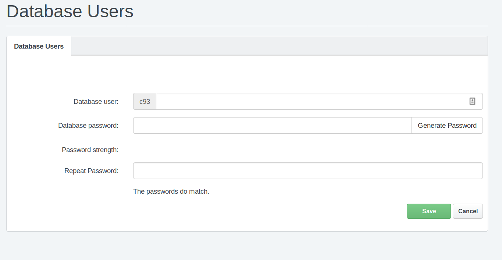
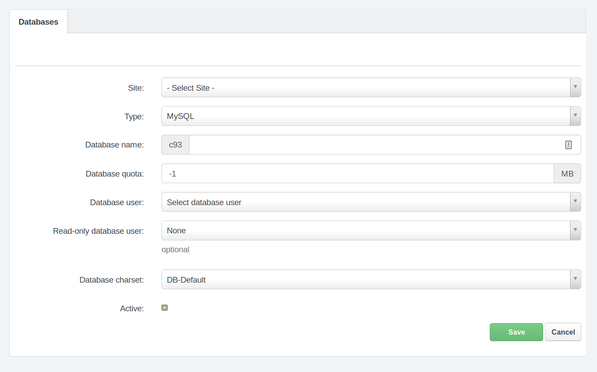
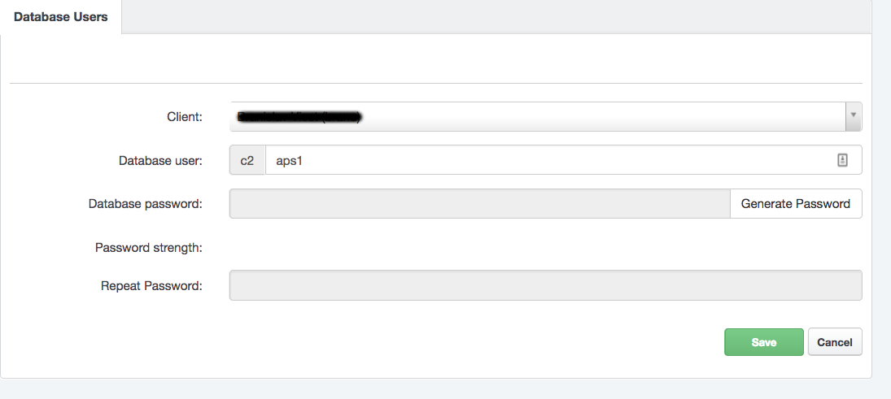

# MySQL Databases

## MySQL Databases Management

MySQL databases and users management is possible in the [Hosting Control Panel](https://my.nuclear.hosting). Log in to your account and navigate to "Sites" section and in the left-hand menu "Databases" section. There are two sections regarding to MySQL databases management:

 * Databases: MySQL Databases management
 * Database Users: MySQL Users management

To create a new MySQL database you need to do 2 steps:

 * Create a new MySQL user (or you can use existing one)
 * Create a new MySQL database and assign newly created user for it

!!! note
	You cannot create a MySQL database without any MySQL user

!!! note
	One MySQL user can by assigned to multiple MySQL databases. This particular user will have access to all of that MySQL databases.

### How to create a new MySQL user

In the [Hosting Control Panel](https://my.nuclear.hosting) navigate to "Sites" section and in the left-hand menu click on the "Database Users".

To create a new database user, click on the "Add new user" button. Now you have to complete the form and enter:

 * Database user name: any username you would like to (preffix is automatically prepended)
 * Database user password: you can use pre-generated by clicking on "Generate password" button or enter your own password
 * Repeat database user password: enter the same password like before

After you complete the form, just click on the Save button.

### How to create a new MySQL Database

Before you create a new MySQL database, make sure you have created any MySQL database user. The steps how to do that are described in above section.

To create a new MySQL database go to your [Hosting Control Panel](https://my.nuclear.hosting) account, navigate to "Sites" and in the left-hand menu click on the "Databases". You can see the list of all your already created MySQL databases. To add a new one, click on the "Add new Database" button.

Next, you have to complete the form:

 * Site: Choose the site you want to create mysql database for. This is optional but recommended.
 * Database name: any database name you would like to (preffix is automatically prepended)
 * Database quota: optional you can set max. database size. The values -1 or 0 means unlimited database size.
 * Database user: choose the database user from previously created database users
 * Read-only database user: optionally you can set read-only mysql user for this database (described below)
 * Database charset: choose database charset, depends on your application but recommended is UTF8MB4
 * Active: you can set this database as active or inactive. When is set like inactive, no access to database is possible

Finally, click on the "Save" button and new MySQL database will be created within minute.

!!! note
	Database will be available within a few minutes. So, take a little time after you create a new database before you start using it.

## MySQL Read-Only User

For any MySQL database you can set up additional Read-only user. This kind of user is allowed perform only SELECT queries in this database.

!!! note
	You can set only one read-only user to any MySQL database

To set up a read only database user, first create a new mysql database user (or you can use already created, but keep in mind that if this user will be assigned to any other database, it will be access to all of these databases). The procedure is described in above section [How to create a new MySQL user](#mysql-databases).

When you have database user ready, navigate to MySQL databases section in the [Hosting Control Panel](https://my.nuclear.hosting) and in the list of databases edit the database, where you want to assign read-only user.

!!! note
	Read-only user can be assigned to database even during creating a new database.

In database edit page change the "Read-only database user" field and select the read-only user you want to set up for this database and click on the "Save" button.

!!! note
	Changes take effect within a few minutes. So, take a little time after you save changes.

## MySQL Administration

To manage your MySQL database (tables, database content) you can use tools Phpmyadmin and Adminer. Both are available at [https://tools.nuclear.hosting](https://tools.nuclear.hosting)

For security reasons, it is not allowed to use the feature 'load data'.

## How to connect to MySQL database from PHP script

The address (hostname / server name) of MySQL server to use in your PHP scripts you can find in your Hosting Control Panel account, on the Dashboard.

!!! note
	Do not use 'localhost' or '127.0.0.1', neither of them will work.

We recommend to use mysqli instead of mysql extension. The extension mysql is available in PHP 5.6 and not longer available in PHP 7.x.

## MySQL Remote Access

Remote access to MySQL database is allowed only for VIP users. There is no exception possible in this limitation for Free users.

Remote access is possible throught SSH tunnel. The connection is routed via SSH to the webserver and from there is redirected to the appropriate database server.

### MySQL SSH Tunnel Login Details

Before you can use MySQL SSH Tunnel for remote access, you have to create a new SSH user. If have no SSH users created yet, [follow these steps](../chroot/#how_to_create_ssh_user).

 * Server hostname: same like for FTP / SFTP / SSH connection. You can find your hostname in Hosting Control Panel, on the Dashboard.
 * Port number: same like for SFTP / SSH connection. You can find your port number in in Hosting Control Panel, on the Dashboard.
 * Username: username of any of your SSH users
 * Password: same like for used SSH user (or you can use SSH Private Key based authentication, depending on your software)
 * MySQL hostname: same like you are using in your PHP applications. It can be found in your Hosting Control Panel account, on the Dashboard.
 * MySQL port: 3306
 * MySQL database username and password are the same like you are using in your PHP application

**Recommended software:**

 * [MySQL Workbench](https://www.mysql.com/products/workbench/)
 * CLI MySQL Client (Linux, Mac OS X)

## How to restore / import MySQL database from backup / dump file

When you need to migrate your mysql database data from another server to Nuclear.Hosting or if you lost your data and need to restore database backup, you have to import your backup / dump file. It has usually .sql or .gz file extension.

To import dump file, prepare your database where you want to import dump file.

!!! note
	We recommend to import full dump of database into empty database, to be sure, you do not override any existing data.

To import dump file there are three options:

 - by using [Phpmyadmin tool](https://pma.nuclear.hosting): After sucessful login, click in your database name in the left-hand menu and than click on the "Import" link located in the top menu on the right side. Select a dump file from your computer by using a "Browse" form ("File to import") and than click on the "Execute" button.
 - by using [Adminer tool](https://admin.nuclear.hosting): After sucessful login click on the "Import" in the left-hand menu and then select a dump file in "File upload" form wich you want to import and click on the "Execute" button.
 - with mysql cli (command line) client (*only for VIP users, SSH access required*)

## How to change password to MySQL database

The password change for MySQL database user is available in the [Hosting Control Panel](https://my.nuclear.hosting). Navigate to "Sites" section and in the left-hand menu "Database Users". In the users overview find a database user for whom you want to change the password and click on them (or click on the edit button).

Enter a new password you want to set up for the user in the "Database password" field and repeat the same password to "Repeat Password" field. You can also generate a new password automatically, by clicking on the "Generate Password" button. To apply changes, click on the "Save" button.

!!! note
	Changes take effect within minutes.

