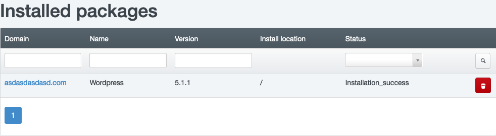

# 1-Click Apps Installer

1-Click Apps Installer a tool which allows you to install a most common and most favourite OpenSource CMS by one click to your domain.

Currently, we are supporting only **Wordpress** installation, however another CMS system will be added shortly.

## 1-Click Apps Installer overview

Log in to your Hosting Control Panel account and click on the ```1-Click Apps``` located on the top menu.



In the list you can see all your apps installation, both sucessful or not.

## Wordpress

### Requirements

To install a Wordpress you need to meet some requirements on domain hosting:
 - Website is active (is not disabled / in-active)
 - PHP is enabled
 - PHP version is same or higher than min. required
 - Enough free disk space

!!! tip
	We recommend to install Wordpress to the empty directory, otherwise, the old files will be backed up automatically.

### Installation

To install a Wordpress click on the ```Install Wordpress``` link in the left-hand menu. The Wordpress version which will be installed is shown in the table. Also, the minimum required PHP version. Install a wordpress to website with lower PHP version than is min. required is not possible.

Now, choose a domain where you want to install Wordpress to. You can also specify a sub-directory (eg. yourdomain.tld/my-wordpress). If you do not want to install Wordpress into sub-directory, leave the ```Sub-directory``` field empty. Enter your admin username, your admin e-mail address (e-mail must be existing and working - to this address you will receive admin credentials to Wordpress admin panel) and choose a Wordpress language. Now just click on the ```Save``` button.


The installation status you can check in the list of installed packages in the ```Status``` column.

### Removal / Un-Installation

If you want to remove previous Wordpress installation made by 1-Click Installer, just click on the red bin button in the list of installed 1-Click apps. All data (FTP, MySQL) will be permanently deleted.