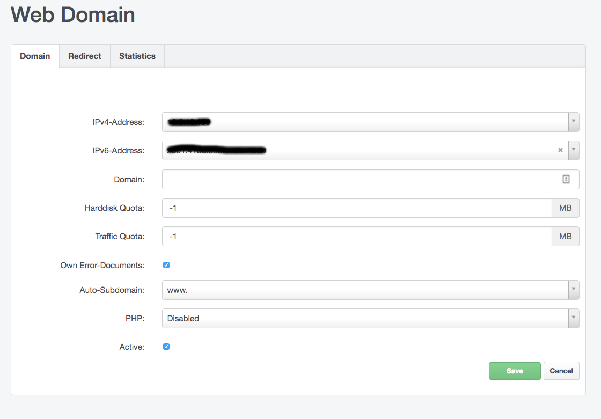
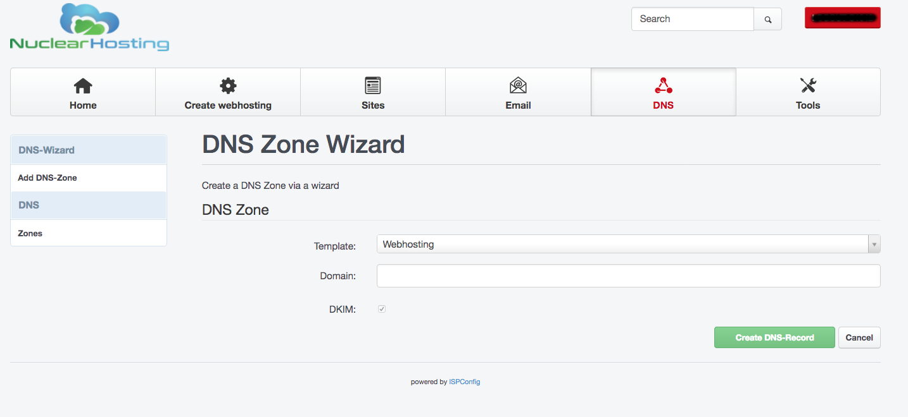
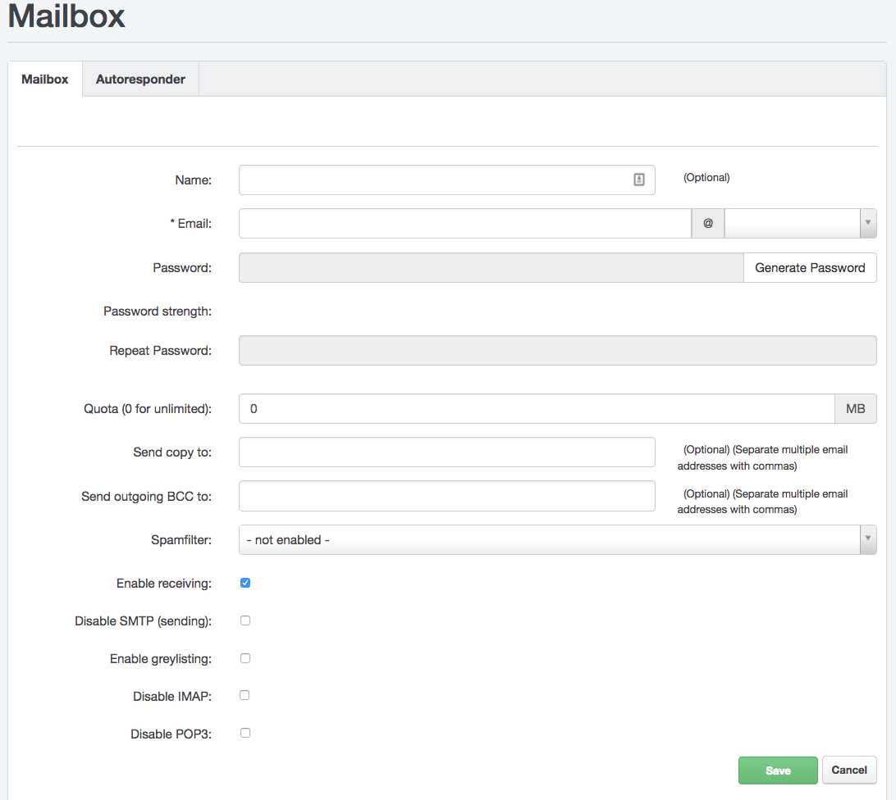
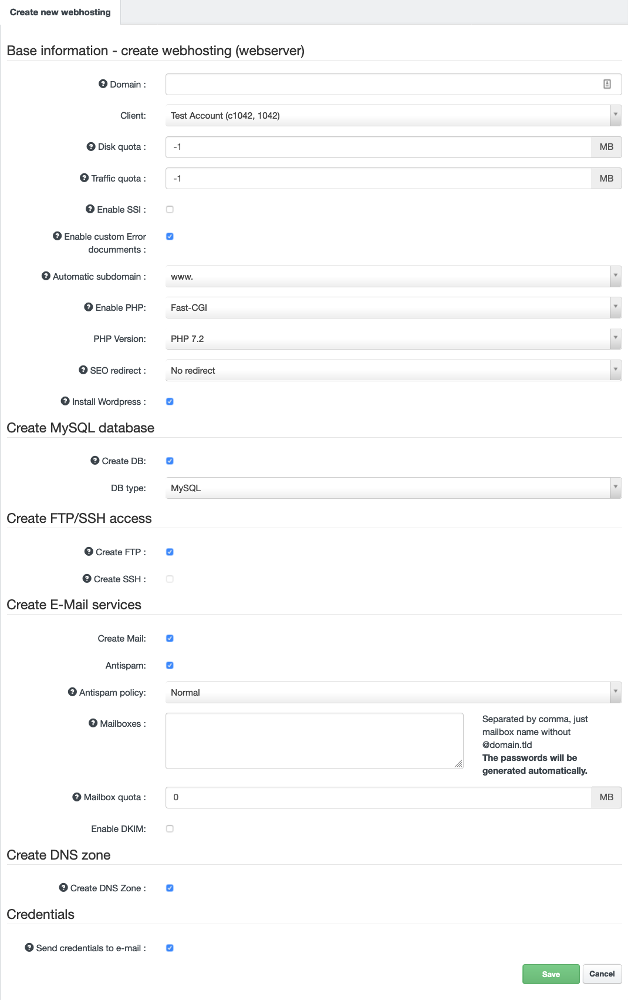

# How to start using hosting

We are delighted that you have chosen Nuclear.hosting. This page is designed to help you get started with our services. You'll find information on getting started, setting up email, uploading your site to a server, creating a database and other useful links to detailed tutorials.

If you are looking for help with ordering or domain registration, please read the [How To Register Domain](../domains/#how-to-get-your-domain-name) and [How to sign-up and order hosting](#how_to_signup) section.

Start by logging in to [Control Panel](https://my.nuclear.hosting). You can find your login details in the email we sent you after confirming your registration. You can also reset a forgotten password in the Control Panel. You set up all your hosting services in the Control Panel.

You will be able to use the hosting services once your registration has been approved.

## How to Sign-Up

To become a member of Nuclear.Hosting all you need to do is complete our simple [registration form](https://nuclear.hosting/create-account). All you need is a valid phone number and a working email address. During the registration process you will need to verify both your email address and phone number by entering the verification codes we will send you.

!!! note
	If you don't verify your email address and phone number, your registration will not be accepted. Verification is a necessary step to prevent spammers and other harmful registrations.

After you complete the registration process with all required verifications, your registration will either be automatically approved and your account will be created immediately, or our manual review and approval will be required. In this case, the approval process usually takes less than 24 hours.

Before you can start using your new web hosting (depending on your membership), you must first pay for your subscription. The payment notice and invoice will be automatically generated and sent to you with the registration approval. You can pay by bank transfer or PayPal. You can find more information on the [Payments & Billing](../billing) page.

## How to launch your website

For your website to work on your domain, it must be uploaded to the webserver and your domain must point to our servers ([read more](../domains/#how-to-point-my-domain-to-nuclearhosting)). If your site uses a database, it will be necessary to set up a database as well.

!!! note
	Prefered way and our recommendation how to setup webhosting for your domain is by [Hosting Wizard tool](#how-to-create-webhosting-using-hosting-wizard).

### Set up domain to webserver

Before uploading your website to the server, you have to set up your domain to the webserver first. In the [Hosting Control Panel](https://my.nuclear.hosting), navigate to ```Sites``` and then ```Websites``` in the left-hand menu. Click on the ```Add new website``` button.

You can configure several different options here, such as **Disk quota**, Enable / Disable custom error pages, Enable / Disable SSI (Server Side Include), **PHP version** and **geo-location of the webserver** where you want to host your website (*VIP Memberships only*). The list of all available geo-locations can be found [here](../websites/#webservers-geo-locations).

Enter your domain name and click on the "Save" button. Alternatively you can use [Hosting Wizard tool](#how-to-create-webhosting-using-hosting-wizard) (see bellow).



**Webhosting for domain will be fully created and ready within 5-10 minutes.**

### Set up domain to DNS

If you are using our DNS Nameservers, you have to create DNS Zone for your domain. Without creating DNS zone for your domain, it will be not working. To create a DNS zone file, log in to [Control Panel](https://my.nuclear.hosting) and navigate to "DNS" section in the top menu.

Now, click on the "Add new DNS Zone with Wizard" button. In "Template" field choose "Webhosting" and enter your domain name into "Domain" field. Now, just click on the "Create DNS-Record".

!!! note
	Any DNS changes take up to 24 hours until release to whole Internet network, so be patient.



### Uploading website to the server

You can upload your websites using two protocols: SFTP / SCP (**VIP Memberships only**) and FTP. For security reasons, we recommend using SFTP protocol. You will need the appropriate software to connect to the server and transfer files, for example FileZilla or WinSCP.

!!! note
	We do not offer WebFTP interface due the outdated and not longer developed software providing WebFTP interface.

Setting up connection and upload of your site's files to the server:

  * To connect to a server, you will need host to connect (server name), username and password. Go to the [Control Panel](https://my.nuclear.hosting) to "Sites" section and then to the "FTP-Accounts" section in the left-hand menu. Here you can create your username and set password. The host (server name) you can find on the dashboard in Control Panel. **FTP Account will be fully created and ready to use within 5-10 minutes.**
  * Once you have connected to the server, you will see several directories (read more about [Directory structure](../files/#directory-structure)), the directory where you need to place your presentation files is named "web".
  * Go to that directory and upload the necessary files to it.
  * As first, after the domain name is entered into the Internet browser, the startup file will be loaded, which must carry a specific name (such as index.html).

**For more information about FTP, SFTP/SSH and how to create a FTP account [click here](../ftp)**.

If you want to install a Wordpress to your domain, you can use our 1-Click Installer and install a new Wordpress by a few clicks! [Read more about Wordpress 1-Click Installer](../wordpress).

### Databases

In addition to file databases, we offer the use of MySQL database systems. For more information about working with it, see [MySQL section](../mysql_databases/).

## How to create an email box and use it

In order to use an email box on your domain, you must first create it and also set up this domain to our email servers.

In the [Control Panel](https://my.nuclear.hosting), in the "Email" section and then "Domains" section in the left menu, you can set up your domain into e-mail servers, by clicking on the "Add new Domain" button.


Create a mailbox in the [Control Panel](https://my.nuclear.hosting) under "Email" and "E-Mail Mailbox" in the left menu. When setting up a mailbox, you set the password to access it, and you can also set up additional mailbox services (redirection, antispam, etc.).



!!! note
	You can also use the [Hosting Wizard tool](#how-to-create-webhosting-using-hosting-wizard) section in Control Panel, which can be used to create both web hosting and mailboxes in one step (see bellow).

For more information about setting up an email box and selecting options, see [Manage mailbox](../emails/#managing-your-mailbox).

The mailbox can be accessed from any mail client using POP3 or IMAP protocols. Alternatively, it is possible to work with the mail from the [web interface (webmail)](https://webmail.nuclear.hosting), but we recommend it only as an additional solution.

### How to configure e-mail client

#### Basic Mail Client Settings:

To set up **receiving emails** in your email client you need to know incoming mail server, username and password.

The name of the incoming mail server (POP3 and IMAP) is **mail.nuclear.hosting**,

**Username** is your full mailbox name (*name@domain.com*) and **password** is you set up while creating your mailbox in Control Panel.

For **outgoing emails** you do not necessarily need to use our sending SMTP server. This may not even be possible, if your ISP does not allow it. To set up our outgoing SMTP server you need to:

 * outgoing mail server name: **smtp.nuclear.hosting**. SMTP server requires a login.
 * use the same username and password as for receiving mail.

## How to create webhosting using Hosting Wizard

Hosting Wizard is tool in Control Panel which allows you to create full webhosting for your domain. In one single step you can create website hosting, set disk quotas, choose PHP version, create DNS zone with all DNS records, e-mail mailboxes, MySQL database, FTP account, set up DKIM, choose webserver geo-location and much more.

To use Hosting Wizard login to your [Control Panel](https://my.nuclear.hosting) account and click on ```Create webhosting``` button located in top menu.

By using a Hosting Wizard you can also install a Wordpress to your domain. Just check the ```Install Wordpress``` field and ```Create DB``` as well.



## How to preview and test your website before DNS change

You can preview and test your website on Nuclear.Hosting before you change your DNS settings. All you have to do is change resolving domain names to IP addresses locally on your computer. Configuration depends on your operating system.

  - First you need to find out what is your servers IP address. Log in to your Hosting Control Panel and in the Dashboard view you will find your webserver IP address.
  - Locate and edit the ```hosts``` file on your computer. Its location depends on your operating system. The following are common locations for this file:
```
  Microsoft Windows: c:\windows\system32\drivers\etc\hosts
  Linux, BSD, Android etc.: /etc/hosts
  Mac OS X: /private/etc/hosts
```
  You have to edit ```hosts``` file as Administrator - with admin rights/permissions.

  - Put into ```hosts``` file content like follow: ```1.2.3.4	example.com www.example.com``` where ```1.2.3.4``` is your webserver IP address you find in your Hosting Control Panel (like described on point 1.) and where ```example.com``` is, put your domain name you want to test from your new hosting.
  - Save and close ```hosts``` file, open your internet browser and enter your domain name. Website is loaded from webhosting on our servers.