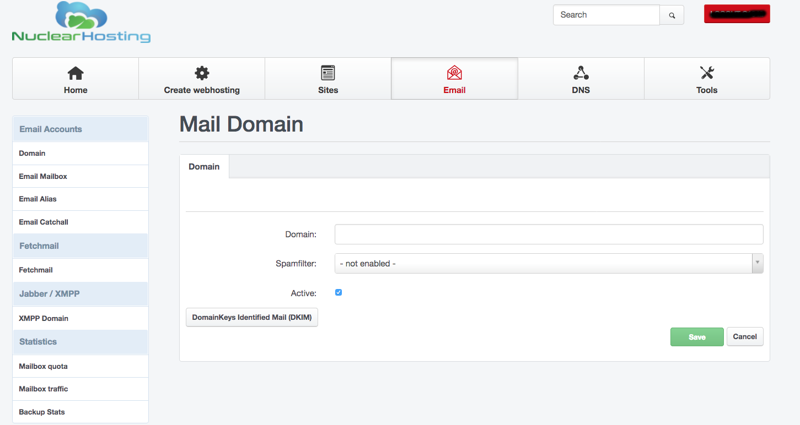

# How to start using hosting

We are very glad you chose Nuclear.Hosting. This page will help you with the first steps of using our services. Here's how to get started, set up emails, upload your site to a server, create a database and other useful links to detailed tutorials.

If you are looking for help with ordering or domain registration, please use the [How To Register Domain](../domains/#how-to-get-your-domain-name) and [How to sign-up and order hosting](../how_to_signup) section.

Start by logging into the [Control Panel](https://my.nuclear.hosting). Your credentials you can find in the email we sent to you after your sign-up confirmation. You can also reset a forgotten password to the Control Panel.

In the Control Panel, you set up all the hosting services.

You can use the hosting services once your registration has been approved. The approval process usually takes less than 24 hours.

## How to launch your website

For your website to work on your domain, it must be uploaded to the webserver and your domain must point to our servers ([read more](../domains/#how-to-point-my-domain-to-nuclearhosting)). If your site uses a database, it will be necessary to set up a database as well.

!!! note
	Prefered way and our recommendation how to setup webhosting for your domain is by [Hosting Wizard tool](#how-to-create-webhosting-using-hosting-wizard).

### Set up domain to webserver

Before uploading your website to the server, you have to set up your domain to the webserver. In the [Control Panel](https://my.nuclear.hosting), navigate to "Sites" section and then "Websites" in the left-hand menu. Click on the "Add new website" button. You can set several different options here, such as Disk quota, Enable / Disable custom error pages, Enable / Disable SSI (Server Side Include), choose PHP version and so on. Enter your domain name and click on the "Save" button. Alternatively you can use [Hosting Wizard tool](#how-to-create-webhosting-using-hosting-wizard) (see bellow).


**Webhosting for domain will be fully created and ready within 5-10 minutes.**

### Set up domain to DNS

If you are using our DNS Nameservers, you have to create DNS Zone for your domain. Without creating DNS zone for your domain, it will be not working. To create a DNS zone file, log in to [Control Panel](https://my.nuclear.hosting) and navigate to "DNS" section in the top menu.

Now, click on the "Add new DNS Zone with Wizard" button. In "Template" field choose "Webhosting" and enter your domain name into "Domain" field. Now, just click on the "Create DNS-Record".

!!! note
	Any DNS changes take up to 24 hours until release to whole Internet network, so be patient.


### Uploading website to the server

You can upload your websites using two protocols: SFTP / SCP (**VIP Memberships only**) and FTP. For security reasons, we recommend using SFTP protocol. You will need the appropriate software to connect to the server and transfer files, for example FileZilla or WinSCP.

!!! note
	We do not offer WebFTP interface due the outdated and not longer developed software providing WebFTP interface.

Setting up connection and upload of your site's files to the server:

  * To connect to a server, you will need host to connect (server name), username and password. Go to the [Control Panel](https://my.nuclear.hosting) to "Sites" section and then to the "FTP-Accounts" section in the left-hand menu. Here you can create your username and set password. The host (server name) you can find on the dashboard in Control Panel. **FTP Account will be fully created and ready to use within 5-10 minutes.**
  * Once you have connected to the server, you will see several directories (read more about [Directory structure](../files/#directory-structure)), the directory where you need to place your presentation files is named "web".
  * Go to that directory and upload the necessary files to it.
  * As first, after the domain name is entered into the Internet browser, the startup file will be loaded, which must carry a specific name (such as index.html).

**For more information about FTP, SFTP/SSH and how to create a FTP account [click here](../ftp)**.

If you want to install a Wordpress to your domain, you can use our 1-Click Installer and install a new Wordpress by a few clicks! [Read more about Wordpress 1-Click Installer](../wordpress).

### Databases

In addition to file databases, we offer the use of MySQL database systems. For more information about working with it, see [MySQL section](../mysql_databases/).

## How to create an email box and use it

In order to use an email box on your domain, you must first create it and also set up this domain to our email servers.

In the [Control Panel](https://my.nuclear.hosting), in the "Email" section and then "Domains" section in the left menu, you can set up your domain into e-mail servers, by clicking on the "Add new Domain" button.



Create a mailbox in the [Control Panel](https://my.nuclear.hosting) under "Email" and "E-Mail Mailbox" in the left menu. When setting up a mailbox, you set the password to access it, and you can also set up additional mailbox services (redirection, antispam, etc.).


!!! note
	You can also use the [Hosting Wizard tool](#how-to-create-webhosting-using-hosting-wizard) section in Control Panel, which can be used to create both web hosting and mailboxes in one step (see bellow).

For more information about setting up an email box and selecting options, see [Manage mailbox](../emails/#managing-your-mailbox).

The mailbox can be accessed from any mail client using POP3 or IMAP protocols. Alternatively, it is possible to work with the mail from the [web interface (webmail)](https://webmail.nuclear.hosting), but we recommend it only as an additional solution.

### How to configure e-mail client

#### Basic Mail Client Settings:

To set up **receiving emails** in your email client you need to know incoming mail server, username and password.

The name of the incoming mail server (POP3 and IMAP) is **mail.nuclear.hosting**,

**Username** is your full mailbox name (*name@domain.com*) and **password** is you set up while creating your mailbox in Control Panel.

For **outgoing emails** you do not necessarily need to use our sending SMTP server. This may not even be possible, if your ISP does not allow it. To set up our outgoing SMTP server you need to:

 * outgoing mail server name: **smtp.nuclear.hosting**. SMTP server requires a login.
 * use the same username and password as for receiving mail.

## How to create webhosting using Hosting Wizard

Hosting Wizard is tool in Control Panel which allows you to create full webhosting for your domain. In one single step you can create website hosting, set disk quotas, choose PHP version, create DNS zone with all DNS records, e-mail mailboxes, MySQL database, FTP account,set up DKIM and much more.

To use Hosting Wizard login to your [Control Panel](https://my.nuclear.hosting) account and click on "Create webhosting" button located in top menu.

By using a Hosting Wizard you can also install a Wordpress to your domain. Just check the ```Install Wordpress``` field and ```Create DB``` as well.

