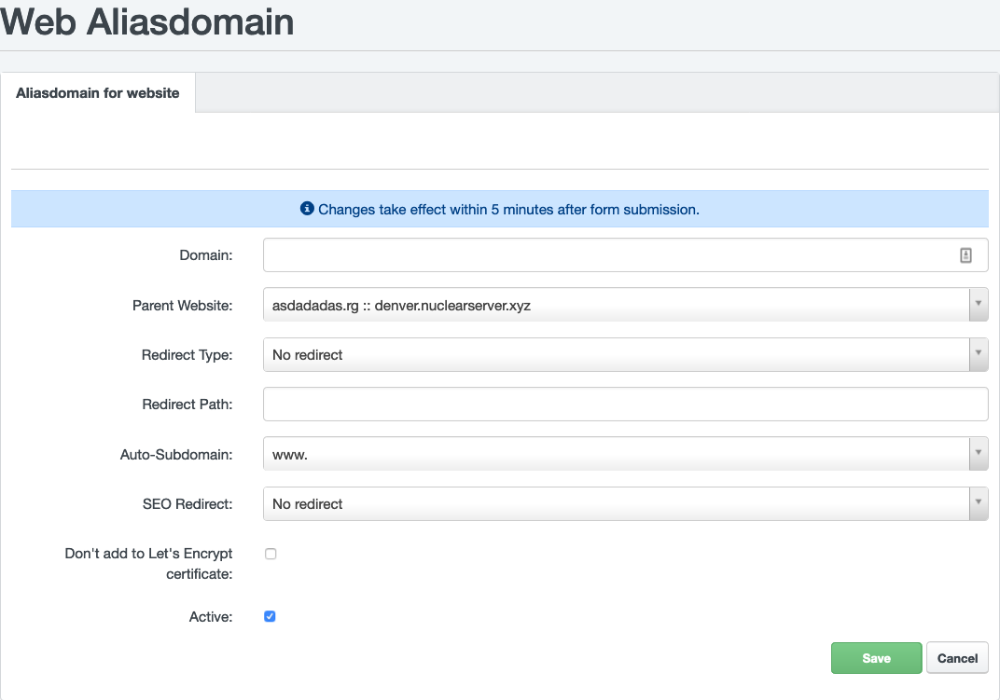

# Domains and Subdomains

Webhosting services are provided to a specific 2nd level domain (example.com). A third level (or subdomain) "www" domain (www.example.com) can be automatically created for this domain (by your choice in [Hosting Control Panel](https://my.nuclear.hosting) during creating a new webhosting), as an alias (example.com and www.example.com are the same web presentation).

## Subdomains

You can create an unlimited number of other subdomains on your domain (my.example.com). Nuclear.Hosting provide **3 types of subdomains** which are sligthly different in usage.

### 1. Subdomain Vhost

#### Description

A subdomain is created like a standalone webhosting but its directory is located under the main domain hosting directory structure. The primary domain will have access to this subdomain directory (eg. with PHP script).

**Subdomain Vhost features:**

 - custom folder name for subdomain
 - turn on / off custom Error pages
 - enable / disable "www" subdomain alias (www.sub.example.com)
 - custom PHP version with custom PHP settings
 - custom password protected AWStats statistics
 - custom redirects
 - Available for both VIP and Basic memberships

**Subdomain Vhost Limitations:**

 - primary domain have access to subdomains data on the server (eg. within PHP script)
 - is linked with primary domain

#### How to create

In the [Hosting Control Panel](https://my.nuclear.hosting) navigate to ```Sites``` section and in the left-hand menu click on the ```Subdomain (Vhost)```. To create a new subdomain click on the green ```Add new subdomain```.

### 2. Subdomain Alias

#### Description

It is like a regular 2nd level domain alias. This subdomain is not physicaly created, it is just an alias which can be redirected (HTTP 301 code) either to primary domain or another domain / URL. Also can be pointed to specific directory on your primary domain FTP account.

**Subdomain Alias features:**

 - it is like an alias / virtual alias
 - can be redirected to another domain (HTTP 301)
 - can be redirected / routed to specific directory on the primary domain
 - different redirection types (by mod_rewrite) like: no flag, R, L, R+L, R=301+L
 - Let's Encrypt SSL Support (optinaly can be turned off for specific subdomain)
 - Available for both VIP and Basic memberships

**Subdomain Alias limitations:**

 - is linked with primary domain
 - primary domain have access to subdomains data on the server (eg. within PHP script)
 - no individual PHP settings or PHP versions (the same PHP version and configuration is applied like on primary domain)

#### How to create

In the [Hosting Control Panel](https://my.nuclear.hosting) navigate to ```Sites``` section and in the left-hand menu click on the ```Subdomain for website```. To create a new subdomain click on the green ```Add new Subdomain```.

### 3. Standalone subdomain

#### Description

Standalone subdomain is like a regular webhosting for 2nd level domain. It is independent on any other domain. It is a full-featured webhosting. **Standalone subdomains are available only for VIP membership users.**

**Standalone subdomain features:**

 - standalone and full-features webhosting with all features
 - indenpedent of any other domain
 - Let's Encrypt SSL support
 - custom PHP version & configuration
 - custom / dedicated FTP enviroment (no shared with any domain)
 - and all regular webhosting benefits and features

**Standalone subdomain limitations:**

 - no shared files / data / folders with primary or any other domain
 - you need a free hosting slot availbe to create a standalone subdomain (within max. domains limits of your account)

#### How to create

The procedure is the same like when you creating a webhosting for a new 2nd level domain. In the [Hosting Control Panel](https://my.nuclear.hosting) navigate to ```Sites``` section and in the left-hand menu click on the ```Website```. To create a new subdomain click on the green ```Add new website```.

### Subdomains comparsion

|     | Subdomain Vhost | Subdomain Alias | Subdomain Standalone  |
|:---| ------------- |:-------------:|:-----:|
| SSL Let's Encrypt | ✓ | ✓ | ✓ |
| SSL Support | ✓ | ✕ | ✓ |
| Custom PHP version | ✓ | ✕ | ✓ |
| Custom PHP Configuration | ✓ | ✕ | ✓ |
| Data accesible from primary domain  | ✓ | ✓ | ✕ |
| Depends on primary domain | ✓ | ✓ | ✕ |
| Custom redirects | ✓ | ✓ | ✓ |
| Full-featured webhosting  | ✕ | ✕ | ✓ |
| Requires available hosting slot  | ✕ | ✕ | ✓ |

## Aliases

### What are domain aliases

An alias is a web server setting that assigns multiple domain names to a single virtual host in server configuration. It allows to display one web site under several domain names.

Alias can be configured in your [Hosting Control Panel](https://my.nuclear.hosting), under ```Sites``` section and then in the left-hand menu click on the ```Aliasdomain for website```.

### How to configure new domain alias

There is several way how to configure domain aliases with several different options regarding usage and behaviour you are expecting.



#### The same web presentations on different domains

You will use this option if you own different domains and you want everyone to have the same website.

Another use-case is when you have a domain pointed to another web hosting, you plan to transfer this domain to Nuclear.Hosting but with a newer website or newer content - you can dev a new version on hosting created on NH, on the original domain name without changing DNS record and just use an alias domain (or alias subdomain) to build a new version of the website and after that, you simply change DNS record of that domain.

**Example:** You have two domain names: ```example1.com``` and ```example2.com```. A domain ```example1.com``` has created a web hosting with website uploaded and is considered as *main* domain. The same content you want to see on the ```example2.com``` without creating an another standalone hosting and duplicating all website files to there, which is unnecessary. To achieve desired behaviour you need to configure ```example2.com``` as alias for ```example1.com``` and change a coresponding DNS record for ```example2.com``` (point domain to our servers).

To configure such domain alias, navigate to your [Hosting Control Panel](https://my.nuclear.hosting), ```Sites``` and ```Aliasdomain for website```, click on the ```Add new Aliasdomain```.

Complete the form as described bellow:

 - ```Domain``` enter your alias domain name
 - ```Parent website``` is a target (website to show when you enter alias domain name) for your alias
 - ```Redirect Type``` keep unchanged (```No redirect```)
 - ```Redirect path``` keep empty
 - ```Auto-Subdomain``` change value when you want to use wildcard-domain within your alias (*.youralias.tld) or www subdomain (www.youralias.tld) or just simple (none value) original alias domain name (name you entered into ```Domain``` field)

 Now just click on the ```Save``` button.

!!! note
	Do not forget to configure DNS zone of your alias domain and point to NH servers. The procedure is the same as for poiting domain for a regular hosting, described [here](/domains/#how-to-point-my-domain-to-nuclearhosting).

#### Different web presentations on different domains on one hosting

FIXME: Toto nejde ako na CH, musi sa to nasmerovat do zlozky v "Cesta presmerovani"

Thanks to aliases, you can run several different web presentations on different domains on one hosting. This solution is suitable in a situation where creating or purchasing standalone hosting for a given domain name would be unnecessary.

In this case you can point your alias domain to existing subdomain on already hosted domain.

**Example:** You have hosting created for a domain ```example.com``` and another domains ```mydomain.net``` and ```yourdomain.org``` where you want to create a simple websites without creating a new standalone hosting accounts for them. To do this, you need to create an two folders on ```example.com``` FTP space, let say ```mydomain``` and ```yourdomain``` in the main ```/web``` folder. Upload your websites to those folders. Configure domain ```mydomain.net``` as an alias for ```example.com``` and configure ```Redirect Path``` to folder ```/mydomain/``` and repeat the same for ```yourdomain.org``` but enter ```/yourdomain/``` to ```Redirect Path```. Configure necessary DNS records. Now when you enter ```mydomain.net``` content from ```example.com/mydomain``` will be loaded and when you enter ```yourdomain.org```, content from ```example.com/yourdomain``` will appear.

To configure this type of domain alias navigate to your [Hosting Control Panel](https://my.nuclear.hosting), ```Sites``` and ```Aliasdomain for website```, click on the ```Add new Aliasdomain```.

Complete the form as described bellow:

 - ```Domain``` enter your alias domain name
 - ```Parent website``` is a target (website to show when you enter alias domain name) for your alias
 - ```Redirect Type``` keep unchanged (```No redirect```) or choose ```L```
 - ```Redirect path``` enter folder name where website for this alias domain will be uploaded
 - ```Auto-Subdomain``` change value when you want to use wildcard-domain within your alias (*.youralias.tld) or www subdomain (www.youralias.tld) or just simple (none value) original alias domain name (name you entered into ```Domain``` field)

 Now just click on the ```Save``` button.

!!! note
	Do not forget to configure DNS zone of your alias domain and point to NH servers. The procedure is the same as for poiting domain for a regular hosting, described [here](/domains/#how-to-point-my-domain-to-nuclearhosting).

## Websites & Web Hosting

### Why we do not support caching servers (memcached, redis)

On our webservers we do not support caching servers like Memcached or Redis.

There is a big security problem with shared hosting and caching servers. Caching servers uses memory that is shared by all customers on the server. Then it is not such a problem to use the content of this shared memory to penetrate a foreign site.

Unfortunately, many shared hosting companies do not address this risk. But for us, safety comes first.

On the other side, the absence of caching servers support we have fast SSD/NVMe disks on all our servers. We are also able to connect for you a special RAM-Disk which is a dedicated piece of RAM memory connected as a regular directory (dedicated for you) where you can place your cache files. The advantage of this solution is that it's very similar to memcached or redis server where cached data are placed into RAM.

## WAF - Web Application Firewall

### What is WAF

A ```web application firewall (WAF)``` is an application firewall for HTTP applications. It applies a set of rules to an HTTP conversation. By inspecting HTTP traffic, it can prevent attacks stemming from web application security flaws, such as SQL injection, cross-site scripting (XSS), file inclusion, and security misconfigurations.

On our servers we are using [ModSecurity](https://www.modsecurity.org/) as WAF.

## TTFB - Time To First Byte

Time to first byte (TTFB) is a measurement used as an indication of the responsiveness of a webserver or other network resource.  TTFB measures the duration from the user or client making an HTTP request to the first byte of the page being received by the client's browser.

Time to first byte is an element of site speed, but a low TTFB on its own is not enough to make a site fast. For example, if a site has a low TTFB but lots of images, ads, javascript files, connecting to external resources (3rd party APIs) then it will still take a long time for the site to load fully.

There are three main components to TTFB:

  - **Request:** When a web browser goes to a website, it sends an http request which gets routed and travels to eventually reach the server that hosts the site.
  - **Server processing:** The server receives the request, pass it to **your web application**, your website processes it and sends back response.
  - **Response:** The response from the server gets routed and travels back to the web browser. TTFB is the time it takes for the first piece of the response to reach the web browser.

The location of your visitors is a big factor because the request has to travel from the visitor’s computer to the server, and then the response has to travel all the way back.

For a website hosted in the US, a visitor from a US city might get a TTFB under 200 milliseconds, while a visitor from Europe could get a TTFB of 1 second or more.

!!! tip
	Do you know that with our VIP Membership you can host your websites in the USA and Europe location? Its only up to you where you place your websites.

The speed of the visitor’s internet is also important. A slow connection with a bad signal could have a much higher TTFB.

One of the most important elements in the TTFB is your website / your web application. The actual response to clients request is generated by your application. Webserver pass clients request to your application (either HTML or PHP). Your application process the request (for example by executing PHP code) and return some output which webserver send back to the client's browser. If your application is slow, executing of your PHP code is slower, not efficient enough, consumes too much server resources, handling a lot of data (from MySQL database or 3rd party services), the request processing will be longer and TTFB will rise essentially.

### How to measure TTFB

There are several free tools you can use to measure your website’s TTFB.

**1. KeyCDN Tool**

This [free tool from KeyCDN](https://tools.keycdn.com/performance) tests your website’s TTFB from 14 different locations around the world.

The difference in TTFB measured is mostly due to the distance from the testing locations to the web server.

**2. WebPageTest**

[WebPageTest](http://webpagetest.org/) has a very detailed speed test tool that gives you a lot of data, including a detailed waterfall chart that shows all the different files that load.

It also gives you a result for TTFB, both an exact number and a letter grade.

**3. PageSpeed Insights**

TTFB is also a component of [Google’s PageSpeed Insights](https://developers.google.com/speed/pagespeed/insights/) test tool. If it is high, the tool gives you a warning and lowers your score.

**4. Google Chrome DevTools / Firefox DevTools**

You can measure TTFB in Google Chrome / Firefox by launching DevTools. Remember, if you are testing from your computer that TTFB is affected by network latency and your internet connection.

!!! notice
	Those 3rd party tools are not perfect and results from them are not 100% reliable and guaranteed. Use them with wisdom, as clues rather than mandatory. The results may differs rapidly from test by test and tool by tool.

### How to improve your TTFB

Regarding to our previous explanation of TTFB, there is a several steps you can do to improve your TTFB.

**1. Optimize your web application**

This is a first and mandatory step to significantly improve your TTFB. What does it mean in particular?

 - analyse your SQL queries, slow queries, simplifie them
 - analyse content in SQL tables, check if you are using indexes, remove old or unnecessary content from SQL tables
 - analyse if your website is connecting to any 3rd party websites or APIs, check how long this connection takes, consider not to call this resource online rather than in CRON or if you have to call them, configure lowest possible timeout for this connection
 - prevent loading a big images, a lot of CSS or JS files, move them to end of the page loading if possible
 - use PHP profiller tool to investigate bottlenecks in your app or NewRelic tool
 - consider to use caching (caching plugin if you are using CMS) to cache and serve static content and/or SQL queries

**2. Keep your server as close to your users as possible**

The distance from the web server is one of the most important determinants of TTFB.

If the majority of your users come from the US, then your site should be hosted in the US. If it’s a UK-specific website, then it should be hosted in the UK or Europe in general.

!!! tip
	Do you know that with our VIP Membership you can host your websites in the USA and Europe location? Its only up to you where you place your websites.

**3. Use a content delivery network (CDN)**

CDN stands for Content Delivery Network.

By using a CDN for your website, you can cache static files like images, css files and javascript files on servers that are close to your visitors. A CDN can speed up your site by serving these static files to your visitors much faster. It does not lower the TTFB of your initial html page file, but it does significantly lower the TTFB of the static files.

Popular CDN network are CloudFlare or OVH CDN.

!!! tip
	If you are interested in about CDN usage, contact us! We can offer you usage of our CDN network with nodes (19 nodes) all over the world.

**4. Switch to a faster web host**

If your web server is poorly configured or not powerful enough to deliver a speedy response to the visitor, then your TTFB will be high.

!!! note
	This option should be considered either as first or as the last option in your journey to lower TTFB. It really depends on many factors. If your app is not working fast enough even on the fastest server/web host you will have poor TTFB.

When it comes to web hosting, you really do get what you pay for. A cheap web hosting provider may be holding your site back and preventing it from reaching its full potential

!!! tip
	Do you know that we in Nuclear.Hosting are using the fastest NVMe SSD drive, we strictly limit the number of websites on every webserver and before every webserver is placed a caching proxy server? This prevents to servers overload (and increasing TTFB) when hundreds or even thousands websites are placed on the one server (to save web host costs which is very common), speed-up and lower disk I/O and serve content much faster.

!!! note
	Interesting about to move your web sites to us? Contact us, we can talk about your issues and needs.