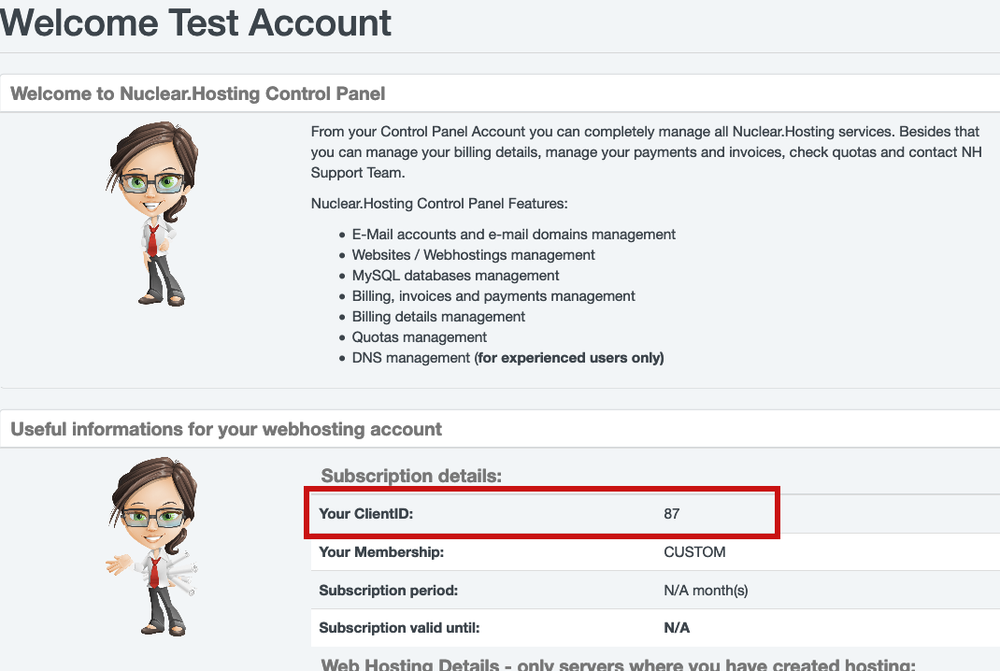
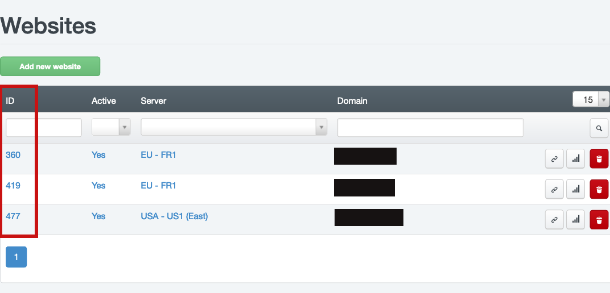

# WebSMTP

**WebSMTP** is Nuclear.Hosting exclusive service developed especially for PrestaShop CMS users, however it can be used by any web application hosted on our webservers.

> Starting with the Prestashop 1.7.7. (released in December 2020) developers have reduced the ability to send e-mails from PrestaShop. Until then, the preferred use of the PHP function mail() has unfortunately ceased to be supported.

The WebSMTP service allows you to sending e-mails from PHP scripts in cases when for some reason it's not possible to use the [standard PHP mail](php.md) function. WebSMTP is a local SMTP server which is available on every webserver. It is reachable only locally - cannot be accessed from other servers / networks.

SMTP Authentication is required to use WebSMTP. You will also need to enter correct server address for connection and username. To connect from a PHP application use the following data:

 - **SMTP Server Address:** it's webserver's private IP address and depending on server, where your web application is located. For correct IP address, refer to table bellow where you can find all webservers private IP addresses. Find your server in the table (the server where your domain is hosted can be found in your [Hosting Control Panel account](https://my.nuclear.hosting)) and use its IP address.
 - **Username:** your username is always in this form: ```nh_websmtp@YOURDOMAIN.TLD```, where YOURDOMAIN.TLD is your domain name (do not use www nor http/https). For example: ```nh_websmtp@nuclearhosting.eu```
 - **Password:** The password is automatically generated by specific pattern. The password is configured automatically. It cannot be changed but you can  get it anytime. The password is contained from following:
   - **Your Hosting Control Panel Username:** the same as your login to [Hosting Control Panel account](https://my.nuclear.hosting)
   - **Your ClientID:** Your client ID can be found in your [Hosting Control Panel account](https://my.nuclear.hosting) on the Dashboard
   - **Keyword** ```WebSMTP_```
   - **Domain ID:** The Domain ID for domain you are configuring WebSMTP. It can be found in the list of your domains (hostings) in [Hosting Control Panel account](https://my.nuclear.hosting). The final password will be like: ```UsernameClientidWebSMTP_Domainid```. Examples can be found bellow.
 - **Port:** 25
 - **Encryption:** none



**WebSMTP is subject to our standard FUP limits:**

 - For Basic membership: 600 emails/hour, 1200 emails / 24 hours
 - For VIP membership: 1800 emails/hour, 3600 emails / 24 hours
 - Max. number of recipients per email is 100
 - The sender's email address must be on the appropriate domain or its aliases. Sending from addresses on other domains is not allowed.

Emails sent by WebSMTP are [DKIM signed](../emails/#dkim) (if you have correctly configured DNS zone).

## The List of Webservers and its WebSMTP IP Addresses

| Server | SMTP IP Address |
|:---: |: ------------- :|
| EU-FR1 | 10.0.10.150 |
| EU-FR2 | 10.0.10.152 |
| USA-US1 | 10.0.10.154 |
| EU-GB1 | 10.0.10.156 |
| EU-PL1 | 10.0.10.157 |
| EU-DE1 | 10.0.10.155 |

## Configuration example

We are configuring WebSMTP for domain example.tld. WebSMTP Username is ```nh_websmtp@example.tld```. To get password, we use the formula mentioned above.

The final password will be ```c20156WebSMTP_99```.

Where "c201" is Hosting CP username, "56" is ClientID shown in [Hosting Control Panel](https://my.nuclear.hosting) dashboard, "WebSMTP_" is static keyword and "99" is Domain id shown in [Hosting Control Panel](https://my.nuclear.hosting) ```Sites``` overview.

