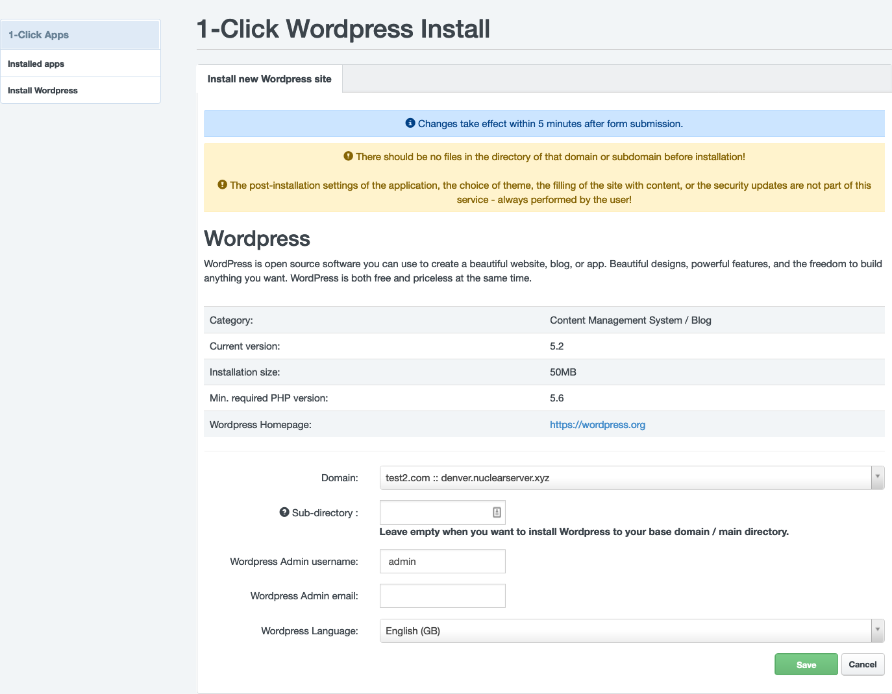
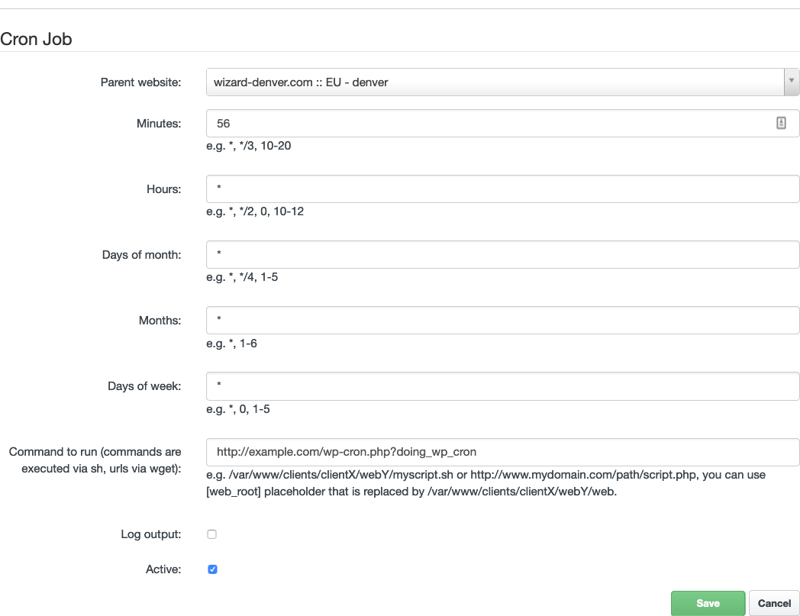

# Wordpress

WordPress is open source software you can use to create a beautiful website, blog, or app. Beautiful designs, powerful features, and the freedom to build anything you want. WordPress is both free and priceless at the same time.

## Installing Wordpress by 1-Click Installer

Installing a Wordpress to your domain on Nuclear.Hosting is such easy! You can install a new Wordpress directly from your [Hosting Control Panel account](https://my.nuclear.hosting) by one click! All installation is completed automatically and your Wordpress is ready tu use within minute.

To install Wordpress using 1-Click Installer log in to your [Hosting Control Panel account](https://my.nuclear.hosting) and click on the ```1-Click Apps``` located on the top menu.

Continue by clicking on ```Install Wordpress``` in the left-hand menu. Now, choose a domain where you want to install Wordpress to. You can also specify a sub-directory (eg. yourdomain.tld/my-wordpress). If you do not want to install Wordpress into sub-directory, leave the ```Sub-directory``` field empty. Enter your admin username, your admin e-mail address (e-mail must be existing and working - to this address you will receive admin credentials to Wordpress admin panel) and choose a Wordpress language. Now just click on the ```Save``` button.



!!! note
	We recommend to install wordpress to empty folder. The existing data will be automatically backed-up.

!!! note
	Installation can take a few minutes - usually it's about two minutes. Login credentials to your Wordpress admin will be sent to e-mail address you entered.

## Delete Wordpress installation from 1-Click Installer

If you want to remove previous Wordpress installation made by 1-Click Installer, just click on the red bin button in the list of installed 1-Click apps. All data (FTP, MySQL) will be permanently deleted.

## WP-CLI: How to use wp-cli to manage Wordpress from cli

WP-CLI is a terminal interface through which you can work with WordPress directly via the terminal and SSH connection. You can, for example, download installation files, install plugin, and perform advanced edits over multiple sites at once.

Using WP-CLI you can manage your whole Wordpress website from shell console, with super-admin privileges. It saves your time and allows you to automatise some processes or help managing a bigger Wordpress websites and installations.

WP-CLI support is available on our VIP hosting. All you need is active SSH access.

### WP-CLI Usage Examples

#### Install files download (Wordpress package download)

```
$ cd /web
$ wp core download --path=dev/wp-cli
Creating directory '/home/sourcecode.sk/sub/dev/wp-cli/'.
Downloading WordPress 4.9.8 (en_US)...
Using cached file '/home/.wp-cli/cache/core/wordpress-4.9.8-en_US.tar.gz'...
Success: WordPress downloaded.
```

With the "wp core download" command, you download the installation files to the folder you are currently in. In the example above, we've set --path=dev/wp-cli to set the files to the dev/wp-cli folder in main web folder.

#### Creating a new wp-config.php file

!!! hint
	Before you start creating a wp-config file, [create a new MySQL Database](mysql_databases/) with a new database user first.

```
$ cd /web/dev/wp-cli
$ wp config create --dbname=wpclidemo --dbuser=wpclidemuser --dbpass=password --dbhost=mysql5-1
Success: Generated 'wp-config.php' file.
```

Entering the "wp config create" command you create a new wp-config.php file with your database data settings. At this point, it is worth mentioning that the "wp db create" command will no longer work because of the nature of our web / DB servers - you can not create a new database using WP-CLI. However, you can work in the local environment.

!!! note
	Creation of MySQL database and database user is available only in [Hosting Control Panel](https://my.nuclear.hosting).

#### Installing Wordpress with database migration

When you have downloaded Wordpress files, created a configuration file (wp-config.php), you can run Wordpress installation process.

In the directory where you have downloaded Wordpress and created wp-config.php file, just run (do not forget to adjust CAPS variables by your needs):

```
$ wp core install --url="ENTER_URL" --title="ENTER_WEBSITE_TITLE" --admin_user="ENTER_ADMIN_USERNAME" --admin_email="ENTER_ADMIN_EMAIL"
```

!!! hint
	When process is completed, do not forget to copy auto-generated admin password.

#### Plugins update

With the "wp plugin update --all" command, you will instantly update all installed WordPress plugins in that folder. In the example below, you can also see the form of the output. You surely noticed that no WordPress password was needed - if you are connected via SSH, with WP-CLI you have full control over everything.

The command above update all you plugins, but you can update them selectively:

```
$ wp plugin update PLUGIN_NAME
```

Where PLUGIN_NAME is name of the plugin you want to update.

#### Themes update

To update all your installed themes just enter in the Wordpress directory:

```
$ wp theme update --all
```

You can also update themes selectively:

```
$ wp theme update THEME_NAME
```

Where THEME_NAME is name of the theme you want to update.

#### Wordpress update

Updating Wordpress installation is also very easy. You can update whole Wordpress installation by command. In the Wordpress directory run:

```
$ wp core update
```

#### Disable WP-CRON

To disable internal Wordpress CRON execution (read more bellow) using WP-CLI utility run:

```
$ wp config set DISABLE_WP_CRON true
```

### More useful WP-CLI commands

To list of all WP-CLI useful features please visit WP-CLI Guide (link bellow), or you can use WP-CLI Help by entering:

```
$ wp help
```

We consider these functions to be very useful:

 * wp comment - Creates, updates, deletes, and moderates comments.
 * wp core - Downloads, installs, updates, and manages a WordPress installation.
 * wp cron - Tests, runs, and deletes WP-Cron events; manages WP-Cron schedules.
 * wp export - Exports WordPress content to a WXR file.
 * wp import - Imports content from a given WXR file.
 * wp media - Imports files as attachments, regenerates thumbnails, or lists registered image sizes.
 * wp option - Retrieves and sets site options, including plugin and WordPress settings.
 * wp plugin - Manages plugins, including installs, activations, and updates
 * wp post - Manages posts, content, and meta.
 * wp role - Manages user roles, including creating new roles and resetting to defaults.
 * wp site - Creates, deletes, empties, moderates, and lists one or more sites on a multisite installation.
 * wp super-admin - Lists, adds, or removes super admin users on a multisite installation.
 * wp theme - Manages themes, including installs, activations, and updates.
 * wp user - Manages users, along with their roles, capabilities, and meta.

### More WP-CLI options

A [WP-CLI guide](https://make.wordpress.org/cli/handbook/) is available on wordpress.org, look for [recommendations](https://make.wordpress.org/cli/handbook/quick-start/) or a [list of all commands](https://developer.wordpress.org/cli/commands/).

## WP-CRON

WordPress uses its own WP-Cron mechanism to run various regular maintenance tasks. The whole functionality is provided by the wp-cron.php script, which runs by default every time you visit the site.

However, this solution has major disadvantages. Given a large number of requests from site visitors (including robots), this script runs with unnecessary server load. In addition, it is called like an external webserver request that occupies another PHP process, the maximum number of which is limited for each domain. Both can have a significant negative impact on the application's response, as well as server load.

For these reasons, we recommend you to turn off the default WP-Cron method and call wp-cron.php by using our system cron function.

To disable the default wp-cron method, insert the following line at the end of the wp-config.php file:

```
define ('DISABLE_WP_CRON', true);
```

or use WP-CLI as described above.

!!! note
	When you install Wordpress by using our 1-Click Wordpress installation, wp-cron is disabled by default. Then, you have to configure cron execution by hand as described below.

Now, you have to setup system cron to regularly call wp-cron.php script on your website. Log-in to your [Hosting Control Panel](https://my.nuclear.hosting), go to ```Sites``` and in the left-hand menu click on ```Cron Jobs``` and then ```Add new Cron job```.

Fill the form like picture shows. In the ```Parent Website``` field choose your domain where you want to configure cron. Into ```Minutes``` field put a random minute value between range 0 - 59. In the ```Command to run``` field replace ```example.com``` by your domain name. Finish setup by clicking on the ```Save``` button.



## Wordpress Speed Optimization Tips

Is your wordpress website slow and response time takes so so long? Read how to speed-up your wordpress website 🤓

### What slow down your Wordpress website?

Learning what slows down your website is the key to improving performance and making smarter long-term decisions.

The primary causes for a slow WordPress website are:

  - **Web Hosting:** When your web hosting server is not properly configured, overloaded or does not use SSD or NVMe drives, it can affect your website speed
  - **WordPress Configuration:** If your WordPress site is not serving cached pages, or is not configured properly, then it will overload your server thus causing your website to be slow
  - **Page Size:** Mainly images that aren’t optimized for web
  - **Bad Plugins:** If you’re using a poorly coded plugin, too many plugins or poorly coded themes, then it can significantly slow down your website
  - **External scripts:** External scripts such as ads, font loaders, etc can also have a huge impact on your website performance

### How to measure your Wordpress speed

The usual way how to measure your website speed is by using specialized external services. It is a good starting point but the result is not a holy grail.

Every time when you use external service to measure your site speed, you have to always keep in mind, that you are using an external service where you do not know how they are providing measurements, how loaded are servers where these measurements are provided and the distance between external measurement servers and your website/server. The difference in real loading time of your website and the time from measurement result may differ rapidly.

Also, keep in mind that those tools does give you information about total load time and some more deeper information about page elements but does not give you detailed information about problematic plugins or problematic themes on your website (slow PHP, PHP bottlenecks, etc).

So, what are the most common online services to test your website speed?

  - [Pingdom Tools](https://tools.pingdom.com/) - Pingdom Tools rates your site based on several metrics. For instance, it shows how many requests were required, how many redirects were performed, and how your site’s speed compares to others. Since the results will differ slightly each time, you’ll want to do this a few times to get an average figure.
  - [GTMetrix]() - GTMetrix works much the same way as the previous tool, but it also provides more in-depth metrics and even offers optimization suggestions based on your results. Remember to run this test a few times as well to get a reliable average result. Once you’ve done that, you’ll have a solid idea of how well your site is currently performing.
  - [WebPageTest](https://webpagetest.org/) - The most detailed tool and in-depth metrics from the previous two. You can choose from many locations from where to proceed with your tests. You can find many important pieces of information in results.
  - [Google PageSpeed Insights](https://developers.google.com/speed/pagespeed/insights/) - Provides you with detailed metrics for both mobile page view and desktop page view. You can find some additional information to help you optimize your website in addition to previous tools.

### How to speed-up your Wordpress

#### Always Keep Your WordPress Updated

!!! important
	**Keeping your Wordpress, themes and plugins updated is essential number on rule!**

As a well maintained open source project, WordPress is updated frequently. Each update will not only offer new features but it will also fix security issues and bugs. Your WordPress theme and plugins may have regular updates, too.

As a website owner, it’s your responsibility to keep your WordPress site, theme, and plugins updated to the latest versions. Not doing so may make your site slow and unreliable, and make you vulnerable to security threats.

In addition to security fixes, the newly released versions can also solve bugs that cause a decrease in the performance of your application, or excessive utilization of server resources. Therefore, our recommendation is either to turn on automatic updates or, if this setting is not possible due to individual adjustments in your application, a regular manual update. For plugins that are marked as obsolete by the developers and are no longer patched, we recommend that you completely uninstall these plugins and, if necessary, select an alternative with the same or similar functionality for them.

#### Optimize Background Processes

Background processes in WordPress are scheduled tasks that run in the background of your WordPress site. Following are some examples of background tasks that run on a WordPress site:

  - WordPress Backup plugin tasks
  - WordPress cron jobs to publish scheduled posts
  - WordPress cron jobs to check for updates
  - Search engines and other crawlers trying to fetch content

Tasks like cron jobs for scheduled posts and updates have minimal impact on website performance.

However, other background processes like backup plugins and excessive crawling by search engines can slow down a website. As for crawling, you need to keep an eye on your crawl reports in Google Search console. Frequent crawls that are ending up in errors can cause your website to slow down or become unresponsive.

The problem is that the default mechanism for running these tasks is very unfortunate in WordPress, especially with regard to creating unnecessary load on the server. To run these tasks, it uses the wp-cron.php script, which is run every time a page is requested/loaded, and therefore usually unnecessarily. Such a mechanism causes more significant problems, especially for presentations with higher attendance. Fortunately, this not entirely ideal behavior on our servers can be easily bypassed. All you have to do in WordPress is to disable such cron execution and instead run the wp-cron.php script only at defined times using our cron ([more information](#wp-cron)).

#### Implement Server Side Caching to Reduce Server Resources Usage

Every webpage visited on your WordPress site requires a request to the server, processing by that server (including database queries), and then a final result sent from the server to the user’s browser. The result is your website, complete with all of the files and elements that make it look the way it does.

For instance, you might have a header, images, a menu, and a blog. Since the server has to process all of those requests, it takes some time for the complete webpage to be delivered to the user–especially with clunky or larger websites.

That’s where a WordPress caching plugins comes into play. Caching instructs the server to store some files to disk or RAM, depending on the configuration. Therefore, it can remember and duplicate the same content it’s been serving in the past. Basically, it reduces the amount of work required to generate a page view. As a result, your web pages load much faster, directly from cache.

Caching dynamically generated content (typically HTML) from server-side applications can significantly improve page load speed, but in some cases can lead to performance degradation and slow response. There are a number of caching plugins for WordPress, but only some are generally a good choice for all cases.

Whenever possible, we recommend that you prefer caching to memory over caches that store the generated data in disk files. Compared to disk caches, memory caches are much faster in terms of writing and reading data. A typical example is a memcached server. Unfortunately, it is not yet possible to run a memcached server on shared web hosting servers. More information can be [found here](/websites/#why-we-do-not-support-caching-servers-memcached-redis).

It is therefore possible to use one of the plugins that implement the disk cache. However, its use must be carefully considered, it is not suitable, for example, with a large number of accesses to a large number of different pages, intensive crawling of pages by robots and / or in the case of rapidly changing content over time. In such cases, the overhead for cache management is greater than its advantages in providing pre-generated content and then generates such a large number of disk operations on the server that in addition to significantly slowing down the response of the application itself can cause server overload and affect other applications (in the case of shared services and other users).

Therefore, if you decide to activate the disk cache, we recommend that you immediately check how turning it on will affect the loading speed of the various pages of the presentation.

We also offer an individual RAMDISK service, which can be used as an alternative between mecached and disk cache. This service allows a fixed allocation of parts of the server's RAM and connect it as a folder in the space of your domain in which you can store cache files. In this case, the files will be physically located in RAM, but you can work with them and access them as if they were stored on disk. If you are interested in such a service, contact our technical support.

To enable Wordpress caching, we would recommend these plugins: [W3 Total Cache](https://wordpress.org/plugins/w3-total-cache/) or [WP Super Cache](https://wordpress.org/plugins/wp-super-cache/).

#### Use Image Optimization to Make Your Media Files Smaller

One of the biggest drains on your site’s resources is its images. They’re great for making your site look amazing and for supplementing your text content, but they also require server space and bandwidth. This is especially true if your site contains high-quality images, such as in a portfolio, gallery, or online store.

Image optimization is a process that compresses the size of an image file without noticeably affecting its quality. This is easy to implement, and you can even automate the process entirely. The first method you can use is to optimize your images before you even upload them to your site. We recommend [TinyPNG](https://tinypng.com/) or [Squoosh.app](https://squoosh.app) because they are free and very easy to use.

There are also numerous plugins that enable you to optimize images automatically when you upload them to your WordPress site. One of the favorite is [ShortPixel](https://wordpress.org/plugins/shortpixel-image-optimiser/) or [WP Smush](https://wordpress.org/plugins/wp-smushit/).


#### Use a Content Delivery Network

While communication is becoming more and more digitized, physical distance is still a factor when it comes to sending information online. Using a Content Delivery Network (CDN) can help you create a consistent and faster experience for visitors, regardless of their geographic location.

A CDN refers to a network of proxy servers that are spread across the world. Each server contains "static" files used to make up your website, which can be used to deliver your static content more quickly to users all over the globe. Not only will this improve your site’s speed, but it will also increase its security.

The easiest way to use a CDN with WordPress is to install a plugin. We recommend [Cloudflare](https://wordpress.org/plugins/cloudflare/), which protects and accelerates your site with minimal configuration required.

#### Clean Up Your Media Library and Post Revisions

It’s not just plugins and themes that can build up over time and clog up your site. As your site grows, your media library will fill up with images, documents, and other files. It’s not unusual for long-running sites to contain hundreds if not thousands of image files, for example.

Even if you use image optimization, this many files can start to strain your server resources. A fair amount of these files might not even be used anymore. There are plugins that can help you out to identify and remove them. In this case, we recommend Media Cleaner plugin.

This plugin will automatically find and delete any unused media files in your library. It will search for files that don’t appear on any pages or posts and place them in a trash.

Another potential resource-waster is post revisions. Post revisions take up space in your WordPress database. Some users believe that revisions can also affect some database queries run by plugins. If the plugin doesn’t specifically exclude post revisions, it might slow down your site by searching through them unnecessarily. You can easily limit the number of revisions WordPress keeps for each article. Simply add this line of code to your ```wp-config.php``` file:

```
define( 'WP_POST_REVISIONS', 4 );
```

This code will limit WordPress to only save your last 4 revisions of each post or page, and discard older revisions automatically.

!!! note
	If you use our 1-Click Wordpress Installer, this setting is already implemented. Anyway, you can change or remove it anytime.


#### Use Faster Plugins and Delete Unused Themes, Plugins

Poorly coded WordPress plugins often load too much bloat whether your site needs it or not. This increases your page load speed and slows down your site.

Each activated plugin is involved in the generation of the page, so a large number of plugins can significantly extend the loading time, even if none of the used plugins is significantly demanding. Therefore, we recommend that you carefully select only those plugins that are necessary for the required functionality of the application. If you are no longer sure that you or visitors to your site will use it during normal operation when installing the plugin, do not install the plugin or at least deactivate it.

For most additional functionality, there are several alternative plugins for WordPress, but of different qualities. Therefore, we recommend that you carefully select the plugin that does not cause known issues, whether performance or otherwise. For initial inspiration, we recommend looking for a rating resp. comparison of considered plugins on specialized sites.

We recommend that you always choose the plugin that only does exactly what you are installing it for. There are also complex plugins that add a large number of functions to WordPress, but you will really only use a few (or just one) of them. However, due to their complexity, these plugins can be more computationally intensive and thus again cause various performance problems. The principle, therefore, is to choose a one-sided plugin for a specific activity that best handles this thing precisely and only.

Even with appropriately selected and tested plugins, it may happen that their default settings are not optimal from the performance point of view, or their settings contain options that can significantly degrade performance. Therefore, for each plugin, we recommend that you carefully consider the best settings according to the documentation and test each setting change carefully.

Improperly chosen theme can significantly negatively affect the speed of loading pages, both due to the load created on the server and due to the large number of elements that need to be loaded and downloaded from the server to render the page in the visitor's browser and also due to downloading data from other external servers. When choosing a theme, we therefore recommend, in addition to a nice graphic design and a richness of functions, also emphasis on the speed of its loading, again with thorough testing. This applies both to freely downloadable themes and to those created by an external supplier.

#### Reduce External HTTP Requests

Many WordPress plugins and themes load all kinds of files from other websites. These files can include scripts, stylesheets, and images from external resources like Google, Facebook, analytics services, and so on.

It’s ok to use a few of these. Many of these files are optimized to load as quickly as possible, so it’s faster than hosting them on your own website. But if your plugins are making a lot of these requests, then it could slow down your website significantly. You can reduce all these external HTTP requests by disabling scripts and styles or merging them into one file.

Another problem are calls to different 3rd party API services or any other external resources which your theme or plugins depend on when processing PHP its codes. If such 3rd service or API is unavailable, your website may slow down rapidly or even may cause complete website downtime.


#### Reduce Database Calls

Unfortunately, there are a lot of poorly coded WordPress themes out there. They ignore WordPress standard practices and end up making direct database calls, or too many unnecessary requests to the database. This can really slow down your server by giving it too much work to do.

To investigate what SQL queries are executing on every specific page load, we recommend to use plugin [Query Monitor](https://sk.wordpress.org/plugins/query-monitor/). This plugin allows you to deeply investigate all executed SQL queries during page loading time, its duration, queries callers (which method call the query) and also if there were any duplicate queries which can be eliminated. Query Monitor plugin gives you some more insights information about request processing which may lead you to improve your Wordpress speed and optimize.

Also, [New Relic](https://newrelic.com) may help you to investigate your Wordpress very deeply and uncover bottlenecks, not only with SQL queries.

#### Reduce the amount of operational data

The performance of the application and the loading speed can be negatively affected by the growing amount of processed data, both in the database and files on the server. More data in the SQL tables used by the database can prolong the execution of database queries (especially more complex ones), increasing the number of files can lead to higher disk load and more disk operations, which again causes slower application response and server load.

We recommend you to regularly delete obsolete articles, old comments under articles, and check the database or files on the server for the accumulation of some temporary data, typically caches, information about logged-in users, access logs, and so on. We also recommend adjusting the settings of plugins that store some temporary data so that they automatically prune it themselves regularly.

#### Disable pingbacks and trackbacks

A pingback is an automated comment that gets created when another blog links to you. There can also be self-pingbacks which are created when you link to an article within your own blog.

We recommend simply disabling these as they generate worthless queries and additional spam on your site. Remember, the less calls your WordPress site has to make the better, especially on high-traffic sites. Not to mention the fact that a pingback on your own website is just downright annoying. Follow the steps below to disable pingbacks.

**Disable Pingbacks from other websites:**

In your WordPress dashboard, click into ```Settings → Discussion```. Under the ```Discussion Settings``` section uncheck the option ```Allow link notifications from other blogs (pingbacks and trackbacks) on new articles.```

**Disable Self-Pingbacks:**

Option to disable Self-Pingbacks is not included in the Wordpress administration interface. You have two options: to use specialized plugin - [No Self Pings plugin](https://wordpress.org/plugins/no-self-ping/), or implement the following PHP code into ```functions.php``` script in your theme.

```
function wpsites_disable_self_pingbacks( &$links ) {
  foreach ( $links as $l => $link )
        if ( 0 === strpos( $link, get_option( 'home' ) ) )
            unset($links[$l]);
}

add_action( 'pre_ping', 'wpsites_disable_self_pingbacks' );
```

#### Limiting Comments and Harmful Bots

There is a lot of harmful bots indexing all websites on the internet. The most of them are harmful and causing website overload or post spam comments. If you are not using a comments system on your Wordpress website, disable commenting in Wordpress options to prevent posting spam comments. If you want to use comments in your website, implement CAPTCHA protection to comments forms. There are several plugins which can help you with CAPTCHA or any other antispam protection.

In our default servers settings are already implemented some limitations and blockations of well-known bad bots which very often causing websites or servers overloads, so your sites are protected also by our side.